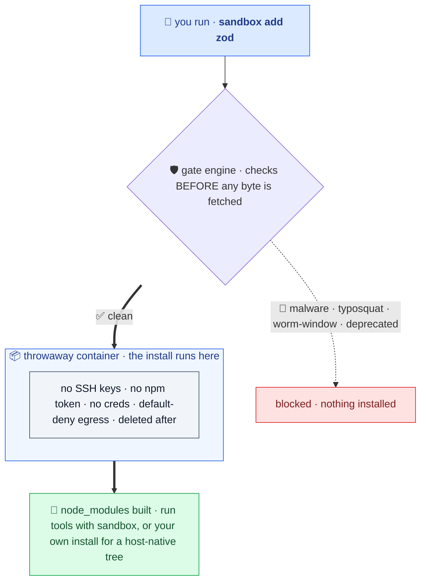

# Catch a bad dependency before it lands

A supply-chain guard for npm, pnpm, yarn, and bun, for everyday work and AI agents. Before an install fetches anything it vets the target versions (malware, typosquats, fresh releases inside the worm window, deprecation), then by default runs your package manager natively on the host so your IDE gets host-native binaries. When you want the real boundary, use explicit `sandbox <pm>` or a devcontainer. `sandbox check` reviews a package without installing anything, no Docker.



Add a dependency with `sandbox add zod`, install with `sandbox install`, refresh with `sandbox update`. It auto-detects npm/pnpm/yarn/bun and mirrors it, vets the target versions, then installs mode-aware (native on a host-native or fresh project, contained when the tree already is). Your real `pnpm` is never shadowed; you opt in by typing `sandbox`. Want the boundary too? Use explicit `sandbox pnpm add zod` or `sandbox devcontainer init`. To review a package without installing, run `sandbox check express` (no Docker). (Already think in your package manager? The expert aliases like `spnpm add zod` are the same mode-aware path, fewer keystrokes. See [Expert: per-PM shortcuts](#expert-per-pm-shortcuts).)

## Quickstart

> **First time?** Run it with no install via `npx @jagreehal/sandbox-node@latest <cmd>`, or add it with `npm i -D @jagreehal/sandbox-node`. You need Docker running. See [Install](#install).

```bash
sandbox setup --vibe         # one-button setup: config, backend check, build images
sandbox add zod              # vet, then install mode-aware (native or contained)
sandbox install              # full install, gated and mode-aware
sandbox update               # refresh deps through the same gates
sandbox x vite               # run a one-off tool in the box
sandbox pnpm add zod         # explicit container boundary for this install
sandbox check express        # vet a package WITHOUT installing (no Docker needed)
sandbox devcontainer init    # containment + a happy IDE: editor and deps both in the container
```

`sandbox add` / `sandbox install` / `sandbox update` are the everyday write path: the verbs you already use, vetted, then run mode-aware (native on a host-native or fresh project, contained when the tree already is). Sandbox auto-detects your package manager (npm/pnpm/yarn/bun) and mirrors it, so you don't name it. Your real `pnpm` is never shadowed; you opt in by typing `sandbox`. When trust drops, the one-keystroke boundary is explicit `sandbox <pm>` or `sandbox devcontainer init`.

Before every write, sandbox prints one line saying what's about to happen and why: `installing natively on the host with pnpm (host-native deps; gates ran, no container boundary)` or `installing in a throwaway container with pnpm (container-built deps; no host creds, default-deny egress)`. A native install runs lifecycle scripts on the host, so the gates are heuristics, not a boundary; the container is the boundary.

## Works with

Every package manager and the verbs you already use. Sandbox detects your PM and mirrors the verb, so `sandbox add zod` runs the right command underneath:

| | install | add / remove | update / dedupe | audit | run / exec |
| --- | --- | --- | --- | --- | --- |
| **npm** | `install` · `ci` | `install <pkg>` · `uninstall` | `update` · `dedupe` | `audit` · `audit fix` · `audit signatures` | `run` · `npx` · `x` |
| **pnpm** | `install` | `add` · `remove` | `update` · `dedupe` | `audit` · `audit --fix` · `audit signatures` | `<script>` · `dlx` · `exec` |
| **yarn** | `install` · bare `yarn` | `add` · `remove` | `up` · `upgrade` · `dedupe` | `audit` | `<script>` · `dlx` |
| **bun** | `install` | `add` · `remove` | `update` | `audit` | `<script>` · `bunx` · `x` |

Anything that pulls *new* versions (`install`, `add`, `update`, `dedupe`, `upgrade`) passes through the same supply-chain gates (release-age cooldown, OSV malware check, and risk hints) before the bytes are fetched. Removing a dependency fetches nothing new, so it skips the gates.

## Always on: the gate engine

Every install is vetted *before any byte is fetched*. No Docker needed for the check (`sandbox check` / `preflight` run it standalone):

- **Known malware.** OSV advisories plus your own malware feeds and team advisories. A match is a hard block.
- **Typosquats & risk hints.** Name-confusion, maintainer takeover, provenance regression, expired domains, suspiciously-low downloads.
- **The worm window.** A release-age cooldown blocks freshly-published versions (where supply-chain worms live); safe-install can substitute an aged release and pin it.
- **Deprecation.** Abandoned versions are blocked by default.

## In the container: the boundary

Explicit `sandbox <pm>` and `sandbox devcontainer init` are the containment surfaces. This is the boundary, and it protects:

- **Credentials.** No `~/.ssh`, `~/.npmrc`, `~/.aws`, or home dir reach the container.
- **Persistence.** `.git`, `.github`, `.husky`, `.claude`, `.vscode`, …, and `package.json` are read-only, so an install can't plant auto-running hooks.
- **Egress.** Default-deny; the install reaches only the registry hosts in `egress.allow`.
- **Capabilities.** `--cap-drop ALL`, `--security-opt no-new-privileges`, container-root ≠ host-root.

## NOT protected

> ⚠️ **Your source tree stays writable, even in the container.** Package managers need a writable root, so a malicious dependency can still overwrite files in `src/` during install. It's not invisible: every contained install reports the project files it changed outside dependencies and records them in the audit log, and `--fail-on-source-writes` (on by default in the `strict` preset) turns that into a non-zero exit. That's detection after the fact, not prevention. Use `--frozen` for a read-only tree (npm, yarn, bun; pnpm keeps a writable root), and review `git diff` after installing from an untrusted source.

| What | How to lock it down |
| --- | --- |
| Your **source files** | `--frozen` makes the whole tree read-only (every PM except pnpm) |
| Anything you **grant** (ssh-agent, paths, env, network) | grant the minimum; prefer ssh-agent over key files |
| **Network in `run`/`shell`** | `run.network` defaults to `none`; widen it with `--dev` |

## Common commands

| Command | What it does |
| --- | --- |
| `sandbox setup [--preset N]` | One-button onboarding: write config, check the backend, build images, print next steps. |
| `sandbox install` · `sandbox add zod` · `sandbox update` | Gated, mode-aware install / add / refresh (auto-detects the PM). |
| `sandbox dev` · `sandbox test` · `sandbox x <tool>` | Run a dev server, a script, or a one-off tool in the box. |
| `sandbox doctor [--fix]` | Check config, package manager, backend, daemon, and image state. |
| `sandbox check [pkg \| file.json]` | Audit deps **before** you install them: OSV advisories, typosquats, fresh/deprecated versions. No container, no Docker. Bare `check` audits the whole project (root + every workspace); pass a `package.json` to audit a specific manifest. |
| `sandbox scan` | Retroactive malware sweep over your committed lockfile (CI/cron). |
| `sandbox secrets [path]` | Offline scan for committed credentials (CI tripwire). |
| `sandbox verify` | CI gate: fail unless the repo commits a real, un-loosened sandbox boundary. |
| `sandbox devcontainer init` | Containment and a happy IDE together: editor + deps in the container (node_modules in a Docker volume). |

Run `sandbox help` for the full surface, or see the [full reference](docs/reference.md).

## Expert: per-PM shortcuts

If you already think in your package manager, the per-PM binaries are the same mode-aware path with shorter keystrokes. Nothing new to learn, just muscle memory:

```bash
sandbox-pnpm add zod   # explicit per-PM binary
spnpm add zod          # terse alias for the same thing
snpm install           # npm
snpx vite              # npx, one-off tool
sbun add hono          # bun
```

Each mirrors the matching package manager while keeping the `sandbox` gate engine in front. They never shadow your real `npm`/`pnpm`/`yarn`/`bun`; you opt in by typing the prefix. Use them or stick with `sandbox add`, both land in the same mode-aware path. Use explicit `sandbox <pm>` when you want the throwaway container boundary.

## On macOS or Windows: host IDEs and `node_modules`

Installs run inside a Linux container, so the package manager fetches the **Linux** build of every platform-specific native dependency. The modern JS toolchain is itself native (esbuild, rollup/rolldown, swc/oxc, vite, lightningcss, `@biomejs/biome`, sharp, …), so on a macOS or Windows host those binaries can't load, and your editor's language server and host commands (`vitest`, `tsx`, the dev server) fail with a cryptic *Cannot find module `@rollup/rollup-darwin-arm64`*. This is near-universal, not an edge case: almost every real project pulls at least one of these.

So on macOS/Windows, pick the mode that matches what you're doing (one mode per project, never both):

- **Run your tools in the box too.** `sandbox test`, `sandbox dev`, `sandbox build` execute on the same Linux platform the install targeted, so the binaries always match.
- **Want a host-native tree for your IDE?** Keep `node_modules` local: run your own `pnpm install`. That is local mode, and your IDE loads native binaries. Sandbox warns before a contained install would replace a host-native tree with a Linux one, so the switch is always deliberate.
- **Want the container boundary AND host editing?** `sandbox devcontainer init` puts the editor and tooling inside the container (node_modules in a Docker volume), so there's no host/container mismatch at all. The cleanest fit for untrusted repos or agent work.

## Turn it off

For a repo you trust, opt out of containment so `sandbox` becomes a transparent passthrough:

```bash
sandbox off        # writes off:true to sandbox.config.local.json (your git-ignored override)
sandbox on         # back in the sandbox
SANDBOX_OFF=1 sandbox install   # one command (or, exported, a whole shell)
```

`off: true` in `sandbox.config.json` does it for the whole team; `sandbox.config.local.json` (or `sandbox off`) does it just for you. Sandbox-only commands (`check`, `doctor`, `verify`, …) keep working either way.

## Install

```bash
# as a dev dependency (recommended):
npm install -D @jagreehal/sandbox-node

# or from this repo:
npm install && npm run build && npm link
```

The first run builds the sandbox image and the egress-proxy image (or run `sandbox build` first).

### Requirements

- **Docker.** Docker Desktop, OrbStack, or any Docker-compatible engine (Podman works via `--backend podman`). It's the only dependency; the CLI builds its own images on first run.
- **macOS or Linux.** On Windows, run inside WSL2 with Docker Desktop (the tool uses a POSIX shell and Unix paths).
- **Node 20 or newer.**

## Learn more

The reasoning before the command reference, in three short posts:

- [npm install runs code you never read](https://arrangeactassert.com/posts/npm-install-runs-code-you-never-read/)
- [How sandbox runs risky installs in a throwaway container](https://arrangeactassert.com/posts/how-sandbox-runs-risky-installs-in-a-throwaway-container/)
- [How to put sandbox in front of npm, pnpm, yarn, and bun](https://arrangeactassert.com/posts/how-to-put-sandbox-in-front-of-npm-pnpm-yarn-and-bun/)

The **[full reference](docs/reference.md)** covers everything else: isolating the agent itself (hooks, devcontainers), install risk hints, the release-age gate, known-malware checks, canary honeytokens, signed receipts & audit logs, CI recipes, the library API (`runCode`), presets, the config manifest, the security gradient, and network control.

## License

Apache-2.0. See [LICENSE](LICENSE) and [SECURITY.md](SECURITY.md).
