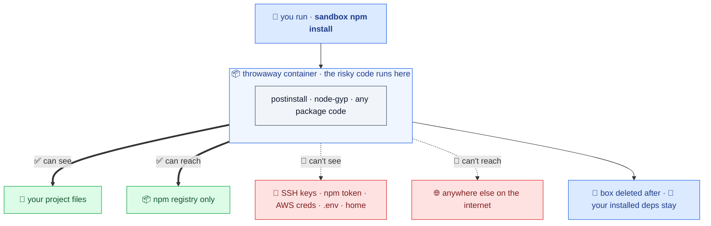
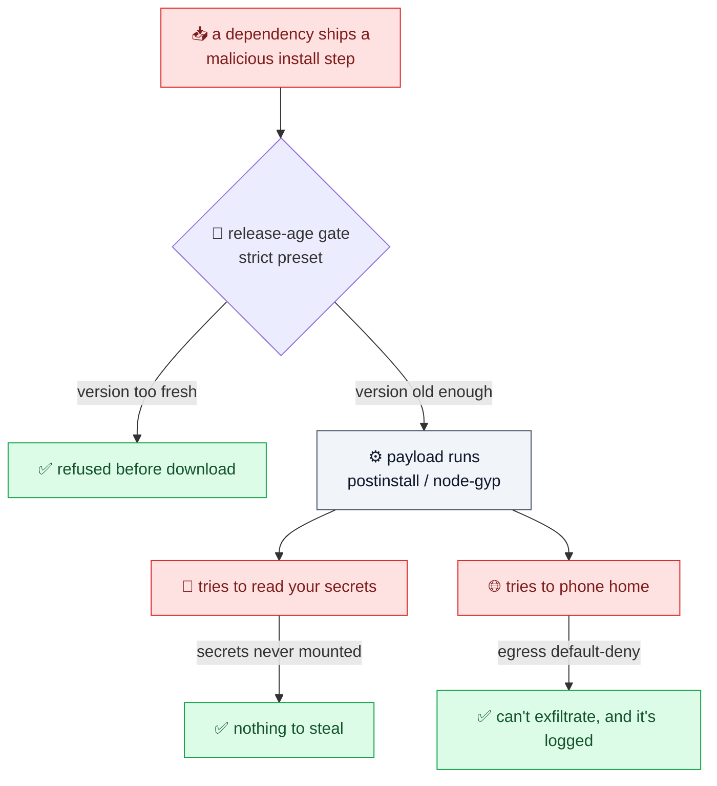
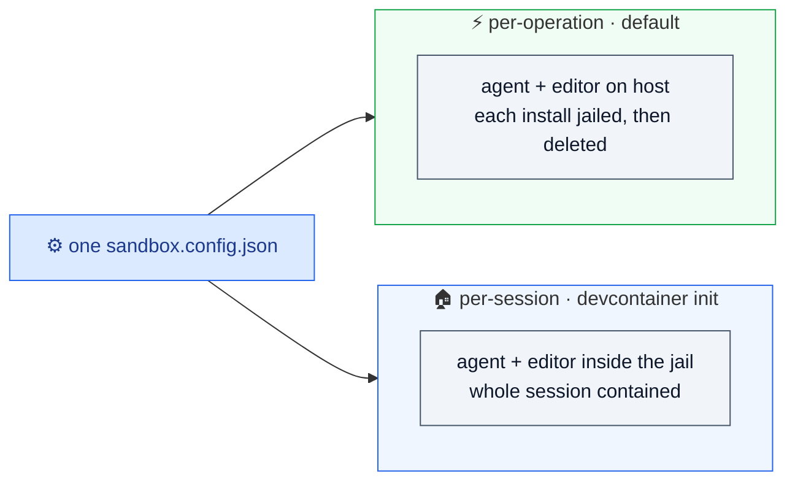
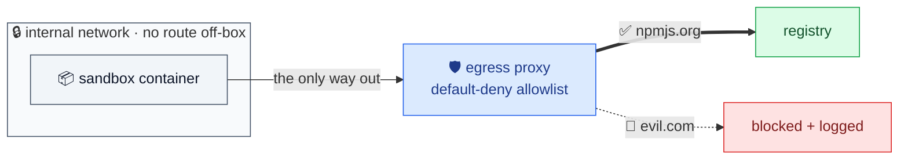

# Put `sandbox` in front of npm, pnpm, yarn, and bun

Safer installs for everyday work and AI agents. Install scripts still work; your laptop secrets stay out.

The whole idea in one picture: your risky `npm install` runs in a throwaway box that can see your project and the npm registry, and nothing else.



Put `sandbox` in front of the npm/pnpm/yarn/bun command you already run. Install-time package code
(`postinstall`, `node-gyp`) runs in a container with no access to your SSH keys, npm token,
cloud credentials, or editor/agent state unless you explicitly grant it.

> **First time?** Get the `sandbox` command with `npx @jagreehal/sandbox-node@latest` (no install) or
> `npm i -D @jagreehal/sandbox-node`, and make sure Docker is running. See [Install](#install) for details.

```bash
sandbox setup --vibe         # one-button setup
sandbox npm install          # install deps — lifecycle scripts are contained
sandbox pnpm add zod         # add a dependency (saved exact by default)
sandbox npm run dev          # run a dev server, tests, a build, …
sandbox npx vite             # one-off tools too
```

Works with **npm, pnpm, yarn, and bun** (`install` / `ci` / `add` / `update` / `audit fix` and any
run/exec script), plus runners like `npx`, `bunx`, `node`, `tsx`, and `vite`. Install scripts still
work; your secrets just aren't there to steal.

Anything that pulls *new* versions is gated the same way as install — the release-age cooldown, OSV
malware check, and risk hints resolve against the versions the command would pull, so a
freshly-published malicious bump is caught before it's fetched:

- `sandbox npm update` (and `pnpm up`, `yarn upgrade`, `bun update`) — update existing deps within range.
- `sandbox upgrade` — move the declared ranges *past* their current bounds (including majors), the
  one thing `npm update` won't do. See [Upgrade ranges safely](#upgrade-ranges-safely--sandbox-upgrade).
- `sandbox npm audit fix` (and `pnpm audit --fix`) — remediate vulnerabilities by pulling fixed
  versions. (Yarn and bun have no in-place audit-fix command.)

Two commands stay intentionally narrow: `bun upgrade` upgrades the bun *binary*, not your packages,
and `yarn npm audit` stays a plain run command because its verb is `npm`, not `audit`.

Vulnerability remediation is install-class too: `sandbox npm audit fix` and `sandbox pnpm audit --fix`
run under the same isolation and gating as install/update. Read-only advisory/signature checks such
as `sandbox npm audit`, `sandbox bun audit`, `sandbox npm audit signatures`, and
`sandbox pnpm audit signatures` use registry-only egress with read-only project mounts.

## Cloning a random repo? Letting an agent install packages?

```bash
git clone https://github.com/some/app && cd app
sandbox setup --vibe         # safe defaults, but dev servers are reachable
sandbox npm install
sandbox npm run dev          # http://localhost:5173 (common dev ports auto-forwarded)
```

For coding agents (Claude Code, Cursor, …), `sandbox setup --agent` always writes the agent
artifacts: `.sandbox/AGENT.md` (repo-local guidance the agent reads) plus two merges into
`.claude/settings.json`: a **`PreToolUse` hook** that blocks a bare `npm install` / `pnpm add` /
`npx …` on the host, and **`permissions.deny` rules** so the agent can't read `.env` or `secrets/**`
into its own context. The config itself changes only when `setup` creates it: with no
`sandbox.config.json` yet (or with `--force`) it writes the `agent` preset, which sets
`grants.claude = "project"` (repo-scoped AI config in `./.claude-sandbox`) and turns on dev servers
while keeping host credentials out. If a config already exists, `setup` reuses it unchanged and only
writes the artifacts. The hook enforces the rule below instead of trusting the model to follow it:

> Use `sandbox npm install` and `sandbox npm run dev`. Don't run npm directly.

To contain the agent's whole blast radius, run it inside a generated devcontainer with
`sandbox devcontainer init`. It applies the same policy in persistent form. See
[Isolating the agent itself](#isolating-the-agent-itself-two-lifecycles).

---

> **Why this exists.** npm supply-chain attacks keep landing: a compromised dependency runs
> code at install time with the same ambient access you have — so it can read your SSH keys,
> the npm token in `~/.npmrc`, and cloud credentials, then exfiltrate them or plant
> persistence. The usual advice ("audit your deps", "use `--ignore-scripts`") is partial:
> `node-gyp` runs without a lifecycle script, and you can't read every transitive package.
> This tool takes a different tack — run installs where there's nothing ambient to steal.

This is **install-time containment, not a general sandbox.** `sandbox npm install` is a
transparent prefix: under the hood it maps to the same install / add / update / run containment
models as the explicit `sandbox install` / `add` / `run` commands (kept as expert and CI forms). It's the
Node member of a `sandbox-*` family (a `sandbox-python` could follow, owning `pip`/`uv`).

Here is the real attack these worms run, and the three independent places `sandbox` cuts it:



## One-command demo

```bash
sandbox setup --vibe
cd demo && sandbox install --foreground-scripts   # runs a simulated malicious postinstall
```

`--foreground-scripts` is a plain npm flag passed straight through; the demo only uses it so you
can see the lifecycle script's output inline. You don't need it for normal installs. In the sandbox
the script finds no credentials and can't write to persistence paths; the same script on the host
would harvest your `~/.npmrc` and `~/.aws/credentials`. See [Quick Start](#quick-start).

## Protected by default

- **Credentials** — no `~/.ssh`, `~/.npmrc`, `~/.aws`, or home dir reach the container.
- **Persistence** — `.git`, `.github`, `.gitlab`, `.husky`, `.claude`, `.claude-sandbox`, `.cursor`, `.gemini`,
  `.vscode`, and `package.json` are read-only, so an install can't plant auto-running hooks.
- **Egress** — default-deny; install reaches only the registry hosts in `egress.allow`.
- **Capabilities** — `--cap-drop ALL`, `--security-opt no-new-privileges`, container-root ≠ host-root.

Install-time registry risk hints are also on by default. They are not a full audit; they are
high-signal prompts for direct packages, while containment remains the main protection.

## NOT protected by default

| What | Why | How to lock it down |
| --- | --- | --- |
| Your **source files** (`src/**`, etc.) | package managers need a writable root; pnpm writes temp files there | `--frozen` makes the whole tree read-only on every package manager except pnpm (pnpm keeps a writable root) |
| Anything you **grant** | ssh-agent, `paths`, `env`, `network: "on"` are explicit opt-ins | grant the minimum; prefer ssh-agent over mounting key files |
| **Network in `run`/`shell`** beyond your config | dev servers/DBs often need it | `run.network` defaults to `none`; widen deliberately |

So `sandbox npm install` is **not** "my repo cannot change" — a dependency can still edit a tracked
source file (you'll see it in `git diff`). It blocks credential theft, persistence, and
exfiltration; it promises source immutability only under `--frozen` (every package manager except
pnpm). See [Install Boundary](#install-boundary).

> ⚠️ **Your source tree stays writable by default.** A malicious dependency can overwrite files in
> `src/`, `lib/`, or anywhere in the project root during install. `sandbox` stops it from stealing
> credentials, planting persistence, or phoning out — it does not stop it editing your code.
> Use `--frozen` for a read-only source tree (npm, yarn, and bun; pnpm keeps a writable root because
> it writes temp files there, so on pnpm `--frozen` locks the lockfile but not the whole tree), and
> review `git diff` after any install from an untrusted source.

## Isolating the agent itself: two lifecycles

You can mean two things by "sandbox my AI coding setup", and they're easy to conflate:

1. **Contain the dangerous *operation*.** `npm install` and `npx` run untrusted dependency code,
   the supply-chain vector. `sandbox` does this by default: the agent and editor stay on your host,
   each risky op runs in a throwaway container, and `sandbox` tears it down after.
2. **Isolate the *agent itself*.** Stop the agent reaching files or credentials it shouldn't across
   your whole machine. A **devcontainer or VM** does this: the agent and editor live *inside* the
   jail for the whole session.

These apply **the same hardening at two lifecycles**, per-operation and per-session. `sandbox`
drives both from one `sandbox.config.json`:

| | Where the agent runs | Containment | Editor/LSP in jail? | Weight | Use when |
| --- | --- | --- | --- | --- | --- |
| **Host + `sandbox`** (default) | host | per-operation (ephemeral) | no (host editor) | light | you trust the agent but not the dependencies |
| **`sandbox devcontainer init`** | inside the jail | per-session (persistent) | yes | heavy | you want the agent's whole blast radius contained, all day |



`sandbox devcontainer init` generates a `.devcontainer/` **from the same config**, so the
persistent mode inherits the ephemeral mode's hardening: a non-root user, the default-deny egress
firewall, Claude Code via the official feature, and a persistent `~/.claude` volume. The two aren't
byte-identical policy. The persistent form is always a networked, long-lived session, and its
firewall allows your `egress.allow` **plus** the domains Claude itself needs (`api.anthropic.com`
and friends), since the agent now runs inside. Same config, same hardening principles, wider
allowlist because the agent moved in.

> **Don't nest them.** Inside the generated devcontainer, run plain `npm install`. Don't use
> `sandbox npm install` in here: the whole environment already **is** the sandbox, and a second
> container launched from inside would need the Docker socket, which is host root and defeats the
> point.

### Enforce the prefix with a hook

A boundary set once beats a prompt on every action. Per-action approval trains you to skim and then
to click through; Anthropic's own testing found developers hit this "approval fatigue" within the
first hour. So the `agent` preset sets the boundary instead of asking: `.sandbox/AGENT.md` *asks*
the agent to use `sandbox`, and a `PreToolUse` hook *enforces* it. The hook
(`.sandbox/hooks/enforce-sandbox.mjs`, wired into `.claude/settings.json`) denies a bare
`npm install` / `pnpm add` / `npx …` before it runs and tells the agent to re-run it through
`sandbox`. Read-only commands (`npm ls`, `npm view`, …) pass through untouched. A model that ignores
the markdown instructions still hits the hook.

The same `--agent` run also adds `permissions.deny` rules for `.env`, `.env.*`, and `secrets/**`.
The container hides host credentials from the *install*, but a host-side agent could still read a
project `.env` into its context and leak it downstream; denying those reads at the Claude Code layer
closes that gap. Deny always wins in Claude Code, so the rules only refuse reads, never grant
anything. Remove a line if you genuinely need it read.

```bash
sandbox init --agent          # AGENT.md + the PreToolUse hook + secret-deny rules, grants.claude=project
```

Two caveats. The hook is **best-effort defense-in-depth, not a sandbox boundary**: it depends on
Claude Code's `PreToolUse` hook API, and a different agent (or a future API change) won't honour
it — the real containment is still `sandbox` running the command in a container. And it edits
`.claude/settings.json` by **merging** into your existing config; if that file isn't valid JSON,
`sandbox` leaves it untouched and prints the snippet to add by hand rather than risk clobbering it.
Review the merged result.

### Stack it with Claude Code's built-in sandbox

Claude Code ships its own [OS-level sandbox](https://code.claude.com/docs/en/sandbox) (`/sandbox`,
backed by Bubblewrap on Linux and Seatbelt on macOS) that isolates the agent's whole command surface
at the kernel. It composes with this tool rather than competing:

- **Claude Code's `/sandbox` (Auto-allow):** kernel-enforced filesystem and network walls around
  every command the agent runs, on the host, with no container. Hides `~/.ssh`, `~/.aws`, and the
  rest of your home directory. Turn it on.
- **`sandbox npm install`:** the install-specific layer on top. `.git`/`.husky`/`.claude`/`.claude-sandbox` are made
  read-only so a postinstall can't plant an auto-running hook (the OS sandbox leaves the project dir
  writable), plus the contain-don't-block lifecycle model, registry risk hints, and the
  `--fail-on-egress` CI tripwire. It also works with no agent at all (plain terminal, CI), which
  `/sandbox` does not.

Run both: `/sandbox` for the agent's blast radius, `sandbox` for the supply-chain surface.

### Run Claude Code inside the sandbox

```bash
sandbox devcontainer init     # generate the persistent, hardened devcontainer
# then: open in VS Code → "Reopen in Container", run `claude` inside
```

`remoteUser` is non-root and the container confines command execution, so you can run the agent
unattended (`claude --dangerously-skip-permissions`) with the egress firewall as the backstop.
Anthropic's reference container documents the same posture. For a quick CLI-only session without the
editor, `sandbox shell` (with `grants.claude` set) drops you into the container too.

The generated Dockerfile **pins the base image by digest** (`FROM …@sha256:…`, resolved at
`init` time), so the toolchain layer is reproducible. It carries a `# renovate:` annotation, so a
repo that runs Renovate gets the digest kept current by its `docker` manager; a repo without
Renovate keeps the digest you pinned until you re-run `init`. A generated devcontainer should be at
least as strict as a hand-rolled one. The Claude Code feature stays pinned to `:1.0` (the spec's
versioning for features). If the registry is unreachable when you run `init`, the Dockerfile falls
back to the tag alone (still annotated); re-run `sandbox devcontainer init --force` while online to
pin the digest.

---

This package ships a CLI and a library. The CLI calls pure `plan*()` functions that return a
serializable execution plan, then `execute()` runs it. Reuse that planning layer in another
CLI, editor integration, GUI, or CI wrapper, and inspect the exact plan with `--json`.

## Install

```bash
# from this repo:
npm install && npm run build && npm link

# or as a dependency:
npm install -D @jagreehal/sandbox-node
```

The first run builds the sandbox image and the egress-proxy image. Run `sandbox build` if you want to build them first.

### Requirements

- **Docker.** Docker Desktop, OrbStack, or any Docker-compatible engine. It's the only dependency, and the CLI builds its own images on first run.
- **macOS or Linux.** On Windows, run it inside WSL2 with Docker Desktop; the tool uses a POSIX shell and Unix paths like `~/.ssh` and `/root`.
- **Node 20 or newer.**

## Try Without Installing

You can bootstrap with `npx` if you just want to try it once:

```bash
npx @jagreehal/sandbox-node@latest init
npx @jagreehal/sandbox-node@latest setup --vibe
npx @jagreehal/sandbox-node@latest npm install
```

Use `@latest` so `npx` does not reuse a stale cached version. For day-to-day use, the normal
`sandbox ...` command is still the better workflow.

## CLI

```text
sandbox [globals] <command> [args]

Pass-through (recommended) — put `sandbox` in front of the command you already know:
  sandbox npm install | pnpm install | yarn | bun install    install deps (contained)
  sandbox npm ci                                      reproducible install (read-only tree)
  sandbox npm install <pkg> | pnpm add <pkg> | bun add <pkg>  add a dependency
  sandbox npm audit | pnpm audit | yarn audit | bun audit     read-only advisory audit
  sandbox npm audit signatures | pnpm audit signatures        verify registry signatures / provenance
  sandbox npm run dev | npm test | npx <tool> | bunx <tool>   run a script or one-off tool

Sandbox commands:
  init [--preset N]    create sandbox.config.json from a preset (interactive, or --preset).
                       --vibe / --agent are shortcuts for those presets
  setup [--preset N]   one-button onboarding: write config if needed, check the backend,
                       build images if needed, then print the next commands
  allow <host...>      add host(s) to egress.allow in sandbox.config.json
  doctor               check config, package manager, backend, daemon, and image state
  build                build or rebuild the sandbox and egress-proxy images
  preflight [pm cmd]   supply-chain review WITHOUT installing: run the gates over what the
                       command would pull, print findings (+ a pin suggestion per blocked
                       package), and exit non-zero exactly when that install would be blocked
                       — e.g. sandbox --min-release-age 7 --fail-on-advisory preflight npm install
  scan                 retroactive malware sweep: re-query OSV for every version in your
                       committed lockfile and exit non-zero if any is NOW flagged as malware.
                       Catches deps that turned malicious AFTER install. No container needed.
  delta [--base <ref>] gate ONLY the dependency changes a PR introduces: diff the lockfile
                       against <ref> (default origin/main) and run the release-age, malware,
                       and deprecation gates on added/bumped versions. Fast, low-noise PR check.
  secrets [path]       offline scan for committed credentials (keys, tokens, private keys, db
                       URLs). Read-only; exits non-zero on any finding. Matches are redacted.
  feeds <update|list>  manage malware feeds (install.malwareFeeds): update fetches + caches them
                       offline; list shows configured/cached feeds. A package on a feed (or in
                       sandbox.advisories.json) ALWAYS blocks installs.
  upgrade [--write]    move declared dependency RANGES to newer versions (npm-check-updates),
                       not just within the range. Your release-age gate drives ncu's --cooldown,
                       proposals go through the same gates as install, and --write rewrites
                       package.json then installs in the sandbox (--minor/--patch/--reject to scope)
  verify [--scan]      exit non-zero unless the repo commits a real sandbox boundary and no
       [--secrets]     personal layer has loosened it — the CI gate behind the badge. --scan
                       adds the malware sweep; --secrets fails on a committed credential
  badge [--workflow F] print a "sandboxed" markdown badge. Bare = static provenance badge;
                       --workflow sandbox.yml = CI-backed verified badge
  devcontainer init    generate a .devcontainer/ from sandbox.config.json — the persistent
                       (per-session) form of the same policy: agent + editor inside the jail

Expert commands (the models the pass-through maps onto):
  install [pm-args]    install deps; persistence paths and package.json stay read-only,
                       host creds stay out, egress defaults to an allowlist
  add <pkg...>         add dependency(ies); this is the only command that writes package.json
  run -- <cmd...>      run a command in the container; network defaults to none
  shell                open an interactive shell in the container

globals (before the command):
  --config <path>    use a specific sandbox.config.json
  --image <tag>      override the sandbox image tag
  --backend docker|podman   container runtime (or $SANDBOX_BACKEND)
  --env <NAME>       forward one host env var by name into the sandbox (grant a secret)
  --env-from <path>  parse a host env file and inject its values; append :KEY,KEY for only those
                     keys (e.g. .env:FOO,BAR). Named --env-from because Node ≥20.6 reserves --env-file.
  --dev              one-off dev mode: run network on + common dev ports; no extra secrets
  --frozen           reproducible install (npm ci / --frozen-lockfile); on every package
                     manager except pnpm the ENTIRE source tree is read-only. Needs a
                     committed lockfile.
  --fail-on-egress   exit non-zero if the proxy blocked any egress (CI tripwire)
  --risk off|basic|thorough  registry risk hints (install/add and npx/dlx): off; basic
                     (packument-only: scripts, fresh/new versions, bins, deprecation,
                     typosquat, provenance regression, maintainer takeover); thorough adds
                     network checks (missing metadata, low downloads, expired domains)
  --fail-on-risk     exit non-zero when risk hints are found (blocks before running)
  --min-release-age <days>  BLOCK any version published fewer than <days> ago (0 disables;
                     overrides config). Strongest control vs publish-and-detonate worms.
  --allow-recent <pat>  exempt a package-name pattern from the release-age gate (repeatable;
                     globs ok, e.g. @myscope/*). Merges with install.minReleaseAgeExclude.
  --deep             extend the blocking gates (release-age, deprecated, and malware when
                     --fail-on-advisory is set) to the whole resolved tree (transitive,
                     from the lockfile: npm + pnpm + yarn), not just direct deps
  --fail-on-advisory  BLOCK when a version is flagged as malware in the OSV advisory DB
                     (the strict preset sets this)
  --full-network     scarier escape hatch: run once with full network (no allowlist);
                     with run/shell it also enables common dev ports
  --dry-run          preview what would be mounted, allowed, and run, then stop
  --json             print the resolved execution plan as JSON instead of running it
                     (env values are redacted; use the library API for the raw plan)
```

The CLI is installed as both `sandbox` and `sandbox-node` (the latter is collision-free if
you also install sibling tools like `sandbox-python` globally).

| Command | What it does |
| --- | --- |
| `sandbox init` | Create `sandbox.config.json` from a preset. Interactive picker, or non-interactive with `--preset strict\|balanced\|vibe\|agent\|trusted [--force]` (`--vibe`/`--agent` are shortcuts). |
| `sandbox setup` | One-button onboarding. Writes `sandbox.config.json` if needed, checks Docker, builds images if needed, then prints the next commands. |
| `sandbox allow <host...>` | Add host(s) to `egress.allow` for this repo. Use it when a trusted install needs something like `nodejs.org` or a private registry host. |
| `sandbox path [install\|uninstall\|status\|print]` | Install shell wrappers (zsh/bash/fish/pwsh) so a bare `npm/pnpm/yarn/bun install` and `npx`/`bunx` route through `sandbox` automatically — the human equivalent of the agent hook. Wraps the package-manager front-ends via shell functions (not a `$PATH` change). Bypass once with `command npm …`, or a whole shell with `SANDBOX_OFF=1`. See [Make it automatic](#make-it-automatic-sandbox-path-the-human-prefix-guard). |
| `sandbox doctor` | Preflight: validates config, detects the package manager, checks the backend binary + daemon, flags a container-escape CVE in the runtime and an end-of-life Node line in the sandbox image, reports workspace root and package workdir in monorepos, surfaces private registry hints from `.npmrc`, and prints fix commands for common failures. Exits non-zero on a hard failure. |
| `sandbox install [args]` | Expert form of the install model. Most users should use `sandbox npm install`, `sandbox pnpm install`, or `sandbox yarn install`. Persistence paths and `package.json` stay read-only. The project root stays writable so `pnpm`/`npm`/`yarn` can write temp files and lockfile updates. Host credentials stay out. `install.network` defaults to `allowlist`, so install reaches only the registry hosts in `egress.allow` unless you opt into more. |
| `sandbox add <pkg...>` | Expert form of the add model. Most users should use `sandbox npm install <pkg>` or `sandbox pnpm add <pkg>`. This model keeps the same isolation as `install`, lets the package manager write `package.json`, and saves added dependencies as exact versions by default. |
| `sandbox run -- <cmd>` | Expert form of the run model. Most users should use `sandbox npm test`, `sandbox npm run dev`, `sandbox npx <tool>`, or similar. `run.network` defaults to `none`. |
| `sandbox shell` | Run `bash -l` in the container. |
| `sandbox preflight [pm cmd]` | Supply-chain review WITHOUT installing. Runs the same gates as a real install (release-age, malware, deprecation, risk hints), prints every finding + a pin suggestion per blocked package, and exits non-zero exactly when that install would be blocked. Use `--json` for a structured report. |
| `sandbox scan` | Retroactive malware sweep over the committed lockfile. Re-queries OSV for every resolved version and exits non-zero if any installed dep is NOW flagged as malware — catches deps that turned malicious after you installed them. No container needed; cheap enough for cron. |
| `sandbox delta [--base <ref>]` | Gate only the dependency changes a PR introduces. Diffs the lockfile against `<ref>` (default `origin/main`) and runs the release-age, malware, and deprecation gates over just the added/bumped versions. Fails safe when the base lockfile is unreadable. Fast, low-noise PR preflight. |
| `sandbox secrets [path]` | Offline scan for committed credentials (~40 provider patterns — API keys, tokens, private keys, database URLs with passwords). Checksum/decode validation (Luhn, JWT header decode) drops false positives, and an entropy fallback catches secret-ish values with no known shape. Read-only, no container; exits non-zero on any finding, so it doubles as a CI tripwire. Matched values are redacted — it reports *where*, never the secret. Defaults to the project root. See [Catch committed secrets](#catch-committed-secrets-sandbox-secrets). |
| `sandbox demo` | Run real supply-chain attacks (credential theft, persistence hook, IMDS pivot, egress exfil) against the live sandbox in a **throwaway** project and show each one contained. No mocks — every attack goes through the same execute path a real install uses. Exits non-zero if any attack isn't contained. See [Watch it work](#watch-it-work-sandbox-demo). |
| `sandbox feeds <update\|list>` | Manage malware **feeds** (`install.malwareFeeds`). `update` fetches the configured feed URLs and caches them locally so the install-time blocklist check stays offline; `list` shows what's configured and cached. A package on a feed — or in a committed `sandbox.advisories.json` — **always blocks** installs, independent of the OSV network lookup. See [Your own blocklist](#your-own-blocklist-team-advisories--malware-feeds). |
| `sandbox upgrade [--write]` | Move declared dependency **ranges** to newer versions (wraps `npm-check-updates`) — what `sandbox npm update` won't do (it stays within the range). Your `minReleaseAgeDays` drives ncu's `--cooldown` automatically, so you only see versions that have aged in; the proposed versions then pass through the **same** malware/deprecation/age gates as install. Without `--write` it previews a gated table; with `--write` it rewrites `package.json` and installs in the sandbox. Scope the jump with `--minor`/`--patch`/`--target`, skip packages with `--reject <pat>`. |
| `sandbox verify [--scan] [--secrets] [--sign]` | Exit non-zero unless this repo commits a real sandbox boundary and no personal layer has loosened it. With `--scan`, also runs the retroactive malware sweep; with `--secrets`, also fails if a credential is committed; with `--sign`, emits an Ed25519-signed receipt of the green boundary to stdout (needs `SANDBOX_SIGNING_KEY`). The CI gate behind the verified badge. See [Signed receipts](#signed-receipts--tamper-evident-audit-log). |
| `sandbox verify-receipt <file>` | Verify a signed receipt from `verify --sign`. `--fingerprint <hex>` (or `SANDBOX_TRUSTED_KEY`) pins the signer so a valid signature from any other key is rejected. |
| `sandbox keygen` | Generate an Ed25519 signing keypair: store the private key as a CI secret (`SANDBOX_SIGNING_KEY`), pin the printed fingerprint via `SANDBOX_TRUSTED_KEY`. |
| `sandbox audit verify <log>` | Verify a hash-chained audit log is intact — every entry recomputes and links to the previous, so any altered or removed entry is caught. Set `SANDBOX_AUDIT_LOG=<path>` on any run to append tamper-evident events (`run`, `egress.denied`, `canary.exfil`). |
| `sandbox badge [--workflow F]` | Print a markdown badge for the README. Bare = static provenance badge; `--workflow sandbox.yml` = CI-backed verified badge that links to real evidence. |
| `sandbox devcontainer init` | Generate a `.devcontainer/` from the same `sandbox.config.json` so the persistent form inherits the same hardening. Add `--force` to overwrite. |

The tool picks a package manager from the lockfile: `pnpm-lock.yaml` first, then `yarn.lock`, then `bun.lock`/`bun.lockb`, then npm.

## Install Risk Hints

Before `sandbox npm install`, `sandbox pnpm add`, and the expert `install` / `add` forms,
the CLI inspects the direct packages it is about to install and emits short, non-blocking warnings.
There are two levels. **`basic`** (the default) runs only checks that come from the package metadata
already fetched, so it adds no extra network round-trips:

- **install scripts**: `preinstall`, `install`, `postinstall`, `prepublish`, `prepare`
- **very recent publishes**: under 24 hours (strong signal) or under 7 days (light signal)
- **brand-new packages**: package first published under 30 days ago
- **command-line binaries**: packages that add a `bin`
- **deprecated versions**
- **typosquatting**: the name is 1–2 edits from a popular package (e.g. `loadsh` ≈ `lodash`),
  checked against a bundled corpus of ~2,500 popular names
- **provenance regression**: an earlier version shipped npm provenance attestations and the version
  you're installing dropped them, a release-path change worth a look
- **maintainer takeover**: the publisher is releasing this package for the first time *and* did so in
  the last 21 days, or a long-dormant maintainer (>6 months) published again

**`thorough`** adds three higher-cost / noisier checks that need an extra request each:

- **missing metadata**: no `repository` and/or `license`
- **low downloads**: under ~50 downloads last month (via the npm downloads API)
- **expired maintainer domain**: a maintainer's email domain no longer resolves (DNS), so it could be
  re-registered to seize the npm account

Every check **fails open**: when a registry, downloads API, or DNS resolver is slow or offline, that
one signal drops and the install proceeds inside containment. It does not hang or block on a lookup.

> **Egress note.** These checks run on the host (before containment), unauthenticated and with no
> credentials. `basic` only reaches your npm registry; `thorough` also reaches `api.npmjs.org`
> (downloads) and does DNS lookups of maintainer email domains. The DNS lookups use the host's
> configured resolver by default (so corporate/split-horizon DNS is respected); set
> `SANDBOX_DNS_SERVERS` (comma-separated IPs) to override, or `--risk basic` to skip the network
> checks entirely.

Example output:

```text
sandbox: checked 12 packages for registry risk hints
sandbox: ⚠ 2 risk hints
sandbox: ⚠ sharp@0.33.5
sandbox: ⚠   has postinstall script — contained in sandbox
sandbox: ✖ loadsh@1.0.0
sandbox: ✖   !! name is within 1–2 edits of popular package: lodash — possible typosquat
sandbox: continuing inside containment
```

Control it with config or per-command flags:

```jsonc
{
  "install": {
    "riskHints": "basic",   // "off" | "basic" (default) | "thorough"
    "failOnRisk": false
  }
}
```

- `sandbox --risk off npm install` disables hints once; `--risk thorough` runs the full set once
- the `strict` preset sets `riskHints: "thorough"`
- `sandbox --fail-on-risk npm install` turns any emitted hint into a blocking preflight
- `--json` stays plan-only and skips registry lookups

**Limits, so you don't over-trust them.** Hints are a signal, not a verdict: a package published
31 days ago can be just as malicious as one published yesterday, so a quiet run doesn't mean
"safe" — containment is the protection, hints are a heads-up. Each registry lookup is capped at 5
seconds; if the registry is slow, rate-limiting you, or offline, the lookup is dropped with a
warning and the install proceeds inside containment with no hints (it never hangs or fails on the
hint step). Hints read the public npm metadata; a private registry that doesn't expose the same
fields (publish times, deprecation) will produce fewer or no hints for its packages.

## Release-age gate (the cooldown)

Risk hints *warn*. The release-age gate *blocks*. Set a threshold in days and `sandbox` refuses to
install any package version published more recently than that:

```bash
sandbox --min-release-age 7 npm install     # block versions younger than 7 days
sandbox init --preset strict                 # the strict preset sets 7 days for you
```

```jsonc
{ "install": { "minReleaseAgeDays": 3 } }    // 0 = off; balanced/agent default to 3, strict to 7
```

**On by default for everyday use.** The schema default is `0`, but the presets turn it on: `balanced`
(the default preset) and `agent` block versions younger than **3 days**, `strict` blocks **7 days**.
`vibe` leaves it **off** (warn-only: the recent-publish hints still fire) so exploring or cloning a
repo isn't blocked by a freshness gate. This matches the "minimum release age on by default" stance
of tools like Aikido Safe Chain. A 3-day floor clears most legitimate installs while closing the
window these worms detonate in.

This is the single control the 2026-06-04 Shai-Hulud/"Miasma" incident named most effective. Worms
of that class publish a malicious version and detonate within hours; the versions that hit were 5
minutes and ~1 hour old. A cooldown refuses to *resolve* anything that fresh, so the install never
pulls it — it falls back to the last version that has aged past the threshold. Example block:

```text
sandbox: ✖ blocked by the release-age gate (min 7 days)
  left-pad@9.9.9 was published 2 hours ago
freshly-published versions are the supply-chain worm window. Options:
  • wait until it ages past the threshold, then retry
  • pin a known-good older version
  • override this once: add --min-release-age 0 before the command
```

How it behaves:

- **On by default** in `balanced`/`agent` (3 days) and `strict` (7 days); **off** in `vibe`
  (warn-only). It can block *your own* fresh publishes and any just-released dependency, so tune it
  per-project (`minReleaseAgeDays`), per-run (`--min-release-age`), or exempt your scope (below). Set
  it to `0` to turn it off.
- **Checks direct deps by default; `--deep` checks the whole tree.** Without `--deep` it gates the
  versions an install/add/`npx` would directly pull. `--deep` reads every resolved version from the
  lockfile (npm, pnpm, and yarn) and gates the transitive tree too, which is where a carrier package
  usually hides. (pnpm 10.16+ also has a native `minimumReleaseAge`; it stacks.)
- **Exempt your own scope.** The gate would otherwise block your own fresh publishes, so list them:
  `minReleaseAgeExclude: ["@myscope/*"]` in config, or `--allow-recent @myscope/*` (repeatable) per
  run. Globs supported. This is what the incident response itself had to add.
- **Fails open on a registry error** (warns and proceeds inside containment) so an npm outage can't
  wedge every install — containment is still the backstop.
- Skipped under `--json` / `--dry-run` (plan-only, no network).

## Known-malware check (the "already bad" axis)

The release-age gate catches *too-new-to-trust*. A separate check catches *known-bad*: with
`--fail-on-advisory` (or `failOnAdvisory: true`, set by the `strict` preset), `sandbox` queries the
[OSV advisory database](https://osv.dev) for the exact version an install/add/`npx` would pull and
**refuses to proceed if that version is flagged as malware** (an OSV `MAL-…` advisory).

```bash
sandbox --fail-on-advisory npm install      # block a known-malicious version
sandbox init --preset strict                 # strict turns this on for you
```

The two gates are complementary: a zero-day worm is too new for any advisory (the age gate stops
it), while a republished known-bad version is caught here even if it has aged past the threshold.
It's opt-in so the default install stays fast and free of an extra service dependency, and it
**fails open** on a lookup error (warns, proceeds inside containment). Non-malware advisories
(ordinary CVEs) are reported as warnings, not blocks.

### Retroactive sweep: `sandbox scan`

The malware check above runs *at install* — it only knows what OSV has flagged at that moment. But
most supply-chain compromises surface **later**: a version is published, looks clean, you install it,
and *days afterwards* OSV files a `MAL-…` advisory for it. `sandbox scan` closes that time gap — it
re-queries OSV for the versions in your **committed lockfile** and exits non-zero if any installed
package is *now* flagged as malware.

```bash
sandbox scan                  # re-check the whole installed tree against OSV
sandbox --json scan           # machine-readable (for CI annotations)
```

It needs no container (a read-only OSV lookup), so it's cheap to run on a schedule. Run it nightly,
or fold it into the boundary gate with `sandbox verify --scan` so a green check means *boundary
intact **and** no installed dependency is currently flagged as malware*. Like the install-time check
it fails open per package on a lookup error, and reports non-malware advisories as warnings.

### Your own blocklist (team advisories + malware feeds)

OSV has publish lag, and the release-age gate only buys you a few days. When *you* already know a
package is bad — an internal incident, a feed you trust, a maintainer you no longer do — you don't
want to wait for OSV. Two offline sources let you block immediately, and a match from either **always
blocks** (install, `preflight`, `scan`, `delta`, and `upgrade`), independent of `--fail-on-advisory`:

- **Team advisories** — drop a committed `sandbox.advisories.json` in the repo root (a per-user global
  one lives at `$XDG_CONFIG_HOME/sandbox-node/advisories.json`). No config needed:

  ```jsonc
  {
    "advisories": [
      { "name": "left-pad", "reason": "internal: do not use", "severity": "high" },
      { "name": "evil-pkg", "versions": ["6.6.6"], "reason": "compromised release" }
    ]
  }
  ```

  A name with no `versions` blocks every version; with `versions` it blocks only those exact cuts.

- **Malware feeds** — list feed URLs in `install.malwareFeeds`, then run `sandbox feeds update` to
  fetch and cache them locally. The install-time check reads the cache, so it stays offline and fast.
  Feeds **augment** OSV (which has publish lag); they don't replace it.

  ```jsonc
  // sandbox.config.json — Aikido's public npm malware list
  { "install": { "malwareFeeds": ["https://malware-list.aikido.dev/malware_predictions.json"] } }
  ```

  ```bash
  sandbox feeds update          # fetch + cache the configured feeds
  sandbox feeds list            # show configured + cached feeds
  ```

  Feeds parse the common shapes — a JSON array of names; objects keyed by `name` **or `package_name`**
  (Aikido's field) with optional `version`/`reason`; a `{ "packages": [...] }` wrapper; or a
  `name,version` CSV. A `*` version blocks every version. A dead feed URL is reported and skipped —
  it never aborts the rest.

### Catch committed secrets (`sandbox secrets`)

The sandbox keeps your host credentials *out* of the install container, but it can't stop a key being
committed into the repo itself — and the moment you `--env-from` a file or grant a path, that secret
is in scope. `sandbox secrets` is the visibility half: a fast, offline scan for high-signal credential
shapes (cloud keys, provider tokens, private keys, database URLs with passwords).

```bash
sandbox secrets               # scan the repo; exit non-zero on any finding
sandbox --json secrets        # machine-readable (for CI)
sandbox verify --secrets      # fold it into the boundary gate
```

It's deliberately high-precision (a provider's distinctive token shape, not every random string),
skips `node_modules`/`.git`/build output/lockfiles/binaries, and **redacts** every match — it reports
the file and line, never the secret. Exiting non-zero makes it a drop-in CI tripwire. Rotate any real
key it finds, move it to an env var, and add the file to `.gitignore`.

Under the hood it carries ~40 provider patterns (cloud keys, source-control tokens, AI-provider keys,
Vault/Vercel/Notion/Linear/…), with two precision tools borrowed from dedicated scanners: **checksum/
decode validation** (a candidate payment-card number must pass Luhn; a `eyJ…` blob must base64-decode
to a real JWT header) drops matches that only *look* right, and an **entropy fallback** flags a
high-randomness value assigned to a secret-ish name (`dbPassword`, `accessToken`) even when the
provider isn't one we hardcode. A bare hex digest or a data-URI blob is *not* flagged — the fallback
needs both high entropy and a credential-shaped key, so it stays quiet on ordinary code.

### Canary honeytokens (catch exfiltration in the act)

Default-deny egress *blocks* a credential from leaving; canaries tell you a thief *tried*. With
canaries on, the sandbox plants fake-but-realistic AWS/Stripe/Slack credentials in the install
container's environment — exactly what a supply-chain script greps `process.env` for — each carrying a
unique nonce. If that nonce ever shows up in the egress proxy's log, a value we planted (one with no
legitimate use) left the box: unambiguous proof of theft, and the run fails hard.

```bash
sandbox --canaries npm install        # plant honeytokens for this install
# on by default in the strict and agent presets
```

Honest scope, because it matters: the proxy can see the request line of **plaintext HTTP** requests
(URL + query) and the **host** of HTTPS `CONNECT`s — so a canary leaked in an HTTP request or used as a
hostname is caught. A canary smuggled inside an *encrypted* HTTPS body to an allowlisted host is **not**
visible to the canary — that case is the egress allowlist's job. Canaries are a tripwire on top of the
boundary, not a replacement for it. The planted env-var names are ones no package manager reads, so
turning them on can't break a real install.

## Watch it work (`sandbox demo`)

`sandbox demo` runs four real supply-chain attacks against the live sandbox — in a throwaway project,
never your repo — and shows each bouncing off a different control:

```text
▶ Plant a git hook (persistence)
    ✓ CONTAINED by persistence paths (.git/.husky/…) are mounted read-only
▶ Steal host credentials
    ✓ CONTAINED by the container starts with none of your host credentials mounted
▶ Pivot to cloud metadata (IMDS)
    ✓ CONTAINED by the metadata guard blackholes the IMDS endpoints
▶ Exfiltrate a secret over the network
    ✓ CONTAINED by default-deny egress (canaries name the stolen value)
demo: all 4 attack(s) contained — the sandbox held on every control
```

No mocks: every attack runs through the same execute path a real install uses, and the command exits
non-zero if anything isn't contained — so it doubles as a CI smoke test that the boundary still holds.

## Signed receipts & tamper-evident audit log

Two ways to turn "the boundary held" into evidence a third party can check, both built on `node:crypto`
(no new dependencies):

**Signed verify receipt** — `sandbox verify --sign` proves a *green* result and signs it with an
Ed25519 key the agent/CI never has to expose, so a later stage can confirm it without re-running the
gate. It composes with `--scan`/`--secrets`: those gates run first, the receipt is emitted **only if
every one passes**, and its `checks` field records exactly what was attested (`boundary`, and `scan`/
`secrets` when requested) — so a receipt can never vouch for malware/secret cleanliness it didn't check.

```bash
sandbox keygen > keys.pem                                    # private key → CI secret; note the fingerprint
SANDBOX_SIGNING_KEY=keys.pem sandbox verify --sign --scan --secrets > receipt.json
sandbox verify-receipt receipt.json --fingerprint <pinned>   # rejects a valid sig from any other key
```

Pinning the fingerprint is what makes it a gate rather than a rubber stamp — without it, anyone could
mint a receipt with their own key.

**Hash-chained audit log** — set `SANDBOX_AUDIT_LOG=<path>` and every run appends a JSONL entry whose
hash commits to the one before it. `sandbox audit verify <log>` recomputes the chain; any entry
altered or removed in place is caught:

```bash
SANDBOX_AUDIT_LOG=.sandbox/audit.jsonl sandbox npm install
sandbox audit verify .sandbox/audit.jsonl
```

The chain proves *internal* consistency (no past entry was rewritten); it doesn't stop someone
discarding the whole file and starting over — for that, pin the latest hash out of band.

## Quick Start

```bash
sandbox setup --vibe                  # write config, check backend, build images, print next steps
cd demo
sandbox install --foreground-scripts  # expert form so the demo can pass npm flags through directly
```

`demo-bad-dep` runs a simulated malicious `postinstall`. In the sandbox it cannot reach credentials or common persistence paths.

```text
# in the sandbox:                         # the same script on the host:
repo persistence write: ✅ BLOCKED        HARVESTABLE: /Users/you/.npmrc
0 credential file(s) reachable ✅          HARVESTABLE: /Users/you/.aws/credentials
                                          5 credential file(s) reachable ⚠️ EXPOSED
```

Preview exactly what a command would do, in plain English, without running it:

```bash
sandbox --dry-run npm install
# sandbox: dry run — nothing was executed
#   command   npm install
#   network   allowlist — reaches only: npmjs.org, npmjs.com
#   writable  /you/app -> /workspace
#   readonly  .git, .github, .husky, .claude, …, package.json
#   grants    none — host credentials stay out
#   security  cap-drop ALL · no-new-privileges · container-root ≠ host-root
```

`--dry-run` is the readable view; `--json` is the same plan for machines:

```bash
sandbox --json npm install | jq '{network, argv, mounts}'
```

## Recommended Workflow

Put `sandbox` in front of the commands you'd run anyway, so installs and anything that
executes dependencies happen in the container:

```bash
sandbox npm install
sandbox npm test
sandbox npm run dev
```

That rule keeps you out of the common trap: host Node trying to execute Linux-built `node_modules`.
Your editor can still read types from `node_modules`. If you prefer the explicit expert surface,
`sandbox run -- ...` maps to the same run model, but most users should stick to the pass-through form.

## Make it automatic: `sandbox path` (the human prefix-guard)

Remembering to type `sandbox` on every install is the same problem the [agent hook](#enforce-the-prefix-with-a-hook)
solves for AI agents — a boundary set once beats a rule you have to remember. `sandbox path` is
the human-shell equivalent: it installs **shell functions** so a bare `npm install` can't run
un-sandboxed out of habit.

`sandbox setup` offers to wire this for you on the spot: answer yes to its prompt and it edits your
shell rc, so you never type the `sandbox` prefix again. To do it directly, or to manage it later:

```bash
sandbox path install      # write the wrappers into your shell rc (auto-detects zsh/bash/fish)
sandbox path status       # installed / current / stale / absent
sandbox path uninstall    # remove them cleanly
sandbox path print        # print the snippet instead (for `eval` or a manual paste; the pwsh path)
# --shell zsh|bash|fish|pwsh  to target a shell other than the detected one
```

Then open a new terminal (or `source ~/.zshrc`). After that, the **install vector** routes
through the sandbox automatically, while everything else hits the real tool untouched:

| You type | What runs |
| --- | --- |
| `npm install`, `pnpm add zod`, `npm ci`, `npm update`, bare `yarn`, `npm audit fix` | **sandboxed** |
| fetch-and-run: `npx`, `bunx`, `pnpx`, `pnpm dlx`, `yarn dlx`, `npm exec` | **sandboxed** |
| `npm run dev`, `npm test`, `npm publish`, `npm ls`, `npm audit`, `node app.js` | the real tool, on the host |

It wraps the package-manager **front-ends only** (`npm`/`pnpm`/`yarn`/`bun`/`npx`/`bunx`), never
`node` itself — running host Node is a separate, deliberate choice. The redirect prints a one-line
notice to **stderr** (so piped output is untouched), and there are always two escape hatches:

```bash
command npm install        # bypass the wrapper for one call
export SANDBOX_OFF=1        # disable the wrappers for the whole shell
```

It's installed as a clearly-marked, versioned block in your rc file — read it, and `sandbox path
uninstall` removes exactly that block and nothing else. This is a **convenience guardrail, not a
containment boundary**: it depends on your interactive shell, so a script that calls `npm` directly,
or a different shell, won't be wrapped — the real protection is still `sandbox` running the command
in a container. For unattended/CI enforcement, use [`sandbox verify` + `--frozen --fail-on-egress`](#continuous-integration);
for agents, the [`--agent` hook](#enforce-the-prefix-with-a-hook).

## Migration Path

If a repo already has host-built dependencies, reset once and switch over:

```bash
rm -rf node_modules
sandbox init
sandbox npm install
sandbox npm test
```

After that, keep the workflow simple:

- install with `sandbox npm install`
- execute with `sandbox npm test`, `sandbox npm run dev`, …

## Common Commands

```bash
sandbox doctor                  # check setup
sandbox npm install             # install dependencies safely
sandbox pnpm add zod            # add a dependency safely
sandbox npm test                # run tests against sandbox-built deps
sandbox npm run dev             # run a dev server in the sandbox
sandbox --env-from .env tsx foo.ts   # run a one-off script with .env vars injected
sandbox --env NPM_TOKEN npm install   # grant ONE host secret in (e.g. a private-registry token)
sandbox --json npm install      # inspect the execution plan
```

Granting a secret is opt-in and per-invocation: `--env <NAME>` forwards a single host env var by
name (nothing else comes with it), and `--env-from <path>` injects the values from one env file.
A private registry also needs its host allowed — `sandbox allow npm.pkg.github.com`.

## Secrets, env vars, and `.env` files

`sandbox` starts the container with an almost-empty environment. Nothing from your shell or your CI
runner is forwarded by default: the container gets `SANDBOX=1`, `HOME=/root`, a blanked `CI`, and
nothing else. Your `~/.npmrc`, `~/.aws`, SSH keys, and the rest of your home directory are not
mounted at all, so there are no ambient secrets for a dependency to read.

You opt a secret in explicitly, per-run or per-project:

| Method | What it does | Scope |
| --- | --- | --- |
| `--env NAME` | forward one host env var by name (its value only) | one run |
| `--env-from path` | parse a host env file and inject **all** its `KEY=VALUE` pairs | one run |
| `--env-from path:FOO,BAR` | parse that file but inject **only** the listed keys | one run |
| `grants.env: ["NAME"]` | forward named host env vars on every run | the project |
| `grants.envFiles: ["path"]` (or `"path:FOO,BAR"`) | parse and inject these files (optionally key-filtered) on every run | the project |

`--env NAME` reads the value from your host environment when the command runs; if the variable
isn't set, nothing is injected. `--env-from` and `grants.envFiles` read a file on the host, parse it
(`KEY=VALUE`, optional `export ` prefix, quotes, `#` comments), and inject the parsed values. The
file itself is never mounted; only its values become container env. When both define the same key, a
named grant wins over an env-file value.

**Loading only some keys from a `.env`.** A bare path injects every key. Append `:KEY,KEY` to inject
only those, so a `.env` holding `FOO` and `BAR` can expose `FOO` and leave `BAR` out:

```bash
sandbox --env NPM_TOKEN npm install        # forward one host var for this run
sandbox allow npm.pkg.github.com           # and allow the private registry host

sandbox --env-from .env npm install        # inject every key in .env
sandbox --env-from .env:FOO npm install    # inject only FOO; BAR never enters
sandbox --env-from .env:FOO,BAZ npm test   # inject only FOO and BAZ
sandbox --env-from .env tsx foo.ts         # one-off script; .env values are injected as env vars
sandbox --env-from .env run -- tsx foo.ts  # explicit equivalent of the pass-through form
```

A requested key that isn't in the file is skipped, the same way `--env` skips an unset variable. The
`:KEY,KEY` suffix is recognised only when every part is a valid env-var name, so a path that happens
to contain a colon is left intact.

One-off tools such as `tsx` use the normal run path. If the script needs outbound network access,
add `--dev` or `--full-network`.

The flag is `--env-from`, not `--env-file`, because Node 20.6+ reserves `--env-file` as a built-in
and would intercept it before `sandbox` sees it (`--env-file` still works as a legacy alias for a
plain existing path, but prefer `--env-from`). In config, `grants.envFiles` takes the same
`"path"` or `"path:FOO,BAR"` form and has no such caveat.

Relative path resolution is deliberate:

- `grants.envFiles` is project config, so relative paths resolve from the **project root**
- `--env-from` is per invocation, so relative paths resolve from the **directory you ran \`sandbox\` from**

That keeps a root config stable in a monorepo while still making one-off leaf-package `.env.local`
files ergonomic.

### A `.env` inside your project is different

The methods above are about your *host* environment. A `.env` file that sits **in the project
directory** is not an env grant: it's part of the tree `sandbox` mounts so the install can run, so
dependency code in the container can read it like any other project file. `sandbox` does not hide
it, the same way it doesn't hide `src/`.

Two things keep that contained:

- **Default-deny egress.** A malicious dependency can read a project `.env`, but under the
  registry-only allowlist it has nowhere to send the contents.
- **The agent deny rules.** `sandbox init --agent` adds `permissions.deny` for `.env`, `.env.*`, and
  `secrets/**`, so a host-side agent won't read them into its context either.

So treat a repo `.env` as readable inside the box but unable to leave it. If you install untrusted
dependencies against a tree that holds real secrets, keep `egress.allow` tight (the default) and
don't widen it to a host the secret would be useful against.

## Continuous integration

CI is where install-time containment pays off most: it's where untrusted dependency code runs
unattended. The pattern is `--frozen` (reproducible, read-only install) plus `--fail-on-egress`
(fail the build if install-time code tries to phone home).

**What this means in practice:** if a malicious dependency runs during
`sandbox --frozen --fail-on-egress npm install`, it should not be able to steal your CI secrets
unless you explicitly grant them or widen the network. The install runs with an almost-empty
environment, default-deny egress, and no home-directory credentials mounted in.

**GitHub Actions:**

```yaml
# .github/workflows/install.yml
jobs:
  install:
    runs-on: ubuntu-latest   # the runner already has Docker
    steps:
      - uses: actions/checkout@v4
      - uses: actions/setup-node@v4
        with: { node-version: 22 }
      - run: npm i -g @jagreehal/sandbox-node
      - run: sandbox --frozen --fail-on-egress npm install
      - run: sandbox npm test
```

**GitLab CI** (Docker-in-Docker service for the sandbox container):

```yaml
install:
  image: node:22
  services: [docker:dind]
  variables: { DOCKER_HOST: "tcp://docker:2375", DOCKER_TLS_CERTDIR: "" }
  script:
    - npm i -g @jagreehal/sandbox-node
    - sandbox --frozen --fail-on-egress npm install
    - sandbox npm test
```

`--frozen` needs a committed, in-sync lockfile. To allow a host your install legitimately needs
(a private registry, `nodejs.org` for native modules), add it once with `sandbox allow <host>` so
it's committed in `sandbox.config.json`. For untrusted pull requests, run the whole job in a
disposable VM or ephemeral runner (see [Residual Risk](#residual-risk-and---frozen)).

### Gate just what a PR changes — `sandbox delta`

A full `--deep` preflight re-checks the entire resolved tree on every run. In a pull request you
usually only care about what the PR *introduces*. `sandbox delta` diffs the lockfile against the
merge target and runs the release-age, malware, and deprecation gates over only the added/bumped
versions — fast, and low-noise:

```yaml
# .github/workflows/deps-delta.yml — on: pull_request
- run: npm i -g @jagreehal/sandbox-node
- run: git fetch origin ${{ github.base_ref }}
- run: sandbox --min-release-age 7 --fail-on-advisory delta --base origin/${{ github.base_ref }}
```

If the base lockfile can't be read it **fails safe** — every resolved package is treated as changed
and gated. Pass `--base-lockfile <path>` instead of a git ref when you have the base file directly.

### Upgrade ranges safely — `sandbox upgrade`

`sandbox npm update` only moves deps *within* their declared range; it never bumps `^4` to `^5`. To
move the ranges themselves you reach for [`npm-check-updates`](https://github.com/raineorshine/npm-check-updates) (`ncu`). But ncu defaults to
the absolute latest version of every dep, including ones published minutes ago. Your release-age gate
exists to close exactly that window.

`sandbox upgrade` wraps ncu and drives it from your config. The `minReleaseAgeDays` you already set
becomes ncu's `--cooldown`, so you only move to versions that have aged in. The proposed versions then
pass the same malware, deprecation, and age gates as a normal install, and nothing is written until
they clear:

```bash
sandbox upgrade                 # preview: a gated table of what could move, package.json untouched
sandbox upgrade --minor         # cap the jump at minor (no major bumps)
sandbox upgrade --reject react  # skip a package entirely
sandbox upgrade --write         # rewrite package.json, then install in the sandbox to refresh the lockfile
```

A blocked upgrade never touches `package.json`, and you get the same pin suggestions as a blocked
install. `sandbox upgrade` uses ncu to discover upgrades, never to write them: it writes the exact
versions you saw gated, so nothing published between preview and write can slip in. ncu reads
`package.json` and queries registry metadata but never runs package code, so discovery runs on the
host while the install that applies the change stays in the jail. ncu is pinned; override it with
`SANDBOX_NCU_SPEC`.

`sandbox upgrade` honors your `minReleaseAgeExclude` entries (and `--allow-recent`) per-package: those
packages may move to a recent version while the rest stay held to the cooldown. ncu's `--cooldown` is
global, so `sandbox upgrade` runs a second cooldown-free pass over just the exempt packages and merges
the results. The age gate still runs over the whole set, so an exemption can't admit anything the gate
would otherwise block.

### Catch deps that go bad *after* merge — scheduled `sandbox scan`

Install-time gates can't see the future; a nightly sweep can. `sandbox scan` re-checks the committed
lockfile against OSV and fails if any installed version is now flagged as malware:

```yaml
# .github/workflows/scan.yml
on: { schedule: [{ cron: '0 6 * * *' }] }
jobs:
  scan:
    runs-on: ubuntu-latest
    steps:
      - uses: actions/checkout@v4
      - uses: actions/setup-node@v4
        with: { node-version: 22 }
      - run: npm i -g @jagreehal/sandbox-node
      - run: sandbox scan
```

### Limit what the install can reach in CI

`sandbox` confines the install to the env vars you grant and the workspace, with default-deny egress
on top. It does not sandbox the rest of the job, only the steps you put `sandbox` in front of. Two
CI-specific notes:

**The checkout credential lives in `.git/config`.** `actions/checkout` defaults to
`persist-credentials: true`, which writes the job's GitHub token into the repo's git config.
`sandbox` mounts `.git` read-only, so install code can read that token (it can't write it).
Default-deny egress stops the token leaving, but set `persist-credentials: false` on the install job
to remove it from the tree entirely:

```yaml
- uses: actions/checkout@v4
  with:
    persist-credentials: false
- run: sandbox --frozen --fail-on-egress npm install
```

**Grant the minimum.** Map only the secrets the install needs (`--env NPM_TOKEN`), prefer
short-lived least-privilege tokens, and keep `egress.allow` as narrow as the install allows. What
you don't grant, the install can't read; what you don't allow, it can't reach.

So the CI security story is:

- **No grant, no read.** If you do not pass a secret into the sandboxed install, dependency code in
  the container cannot read it.
- **No allow, no exfil.** If a host is not in `egress.allow`, install-time code cannot send data to
  it; `--fail-on-egress` turns that attempted exfiltration into a failed build.
- **Workspace files still matter.** Anything already in the repo checkout can still be readable
  inside the install boundary unless it is separately protected. The main CI gotcha is the checkout
  token written to `.git/config` when `persist-credentials: true` is left on.

## Team setup: commit the boundary, gate it in CI, badge it

Three steps turn "everyone configures their own machine" into one reviewed policy that CI enforces
and a badge advertises. The pieces reinforce each other: the committed config is the source of
truth, `sandbox verify` proves it in CI, and the badge links to that proof.

**1. Commit the boundary.** Run `sandbox init` and commit `sandbox.config.json`. Now the boundary
is one reviewed file — widening egress or adding a credential grant shows up in a PR diff, not in
some teammate's global npm setup. Personal tweaks go in `sandbox.config.local.json` (auto-`.gitignore`d);
a personal layer that loosens the committed boundary is [warned on every run](#layered-config-team-shared--personal-override).

**2. Gate it in CI.** `sandbox verify` exits non-zero unless this repo commits a real boundary and
no personal layer loosened it — so CI is where enforcement actually bites. A dev can skip the
sandbox locally, but nothing merges without passing through it:

```yaml
# .github/workflows/sandbox.yml
name: sandbox
on: [push, pull_request]
jobs:
  verify:
    runs-on: ubuntu-latest
    steps:
      - uses: actions/checkout@v4
        with: { persist-credentials: false }
      - uses: actions/setup-node@v4
        with: { node-version: 24 }
      - run: npx @jagreehal/sandbox-node verify          # the boundary is committed & un-loosened
      - run: npx @jagreehal/sandbox-node --frozen --fail-on-egress npm install   # …and installs go through it
```

**3. Badge it.** `sandbox badge` prints a markdown snippet for your README. Bare gives the static
provenance badge (claims "installs sandboxed" — a workflow fact, never "safe"). `--workflow sandbox.yml`
gives the **verified** badge: a GitHub Actions status badge that's green only when the job above
passes, so it links to real evidence instead of asserting trust.

```bash
sandbox badge                       # static provenance badge
sandbox badge --workflow sandbox.yml   # CI-backed verified badge (--repo owner/name to override detection)
```

## Running A Dev Server

The simplest path is the `vibe` (or `agent`) preset, which turns on the run network and
auto-forwards the common framework dev-server ports (Vite `5173`/`4173`, Next/Remix `3000`,
Astro `4321`, Angular `4200`, webpack `8080`):

```bash
sandbox setup --vibe
sandbox npm run dev             # open http://localhost:5173 — whichever port your app picks is mapped
```

Works the same for `pnpm`, `yarn`, and `bun`:

```bash
sandbox pnpm run dev
sandbox yarn run dev
sandbox bun run dev
```

### Hot-reload and file watching

The sandbox bind-mounts your project directory, so edits on the host reach the container with no
copy step. Dev servers with hot module replacement run inside the sandbox: Vite, webpack HMR,
Next.js Fast Refresh, and Bun's `--hot`.

- **HMR (Vite / webpack / Rspack / Turbopack)** — edit `src/App.tsx` and the browser updates.
- **File watchers (`--watch`, `nodemon`, `tsx watch`)** — edit a source file and the process restarts.
- **Bun `--hot`** — works the same as npm/pnpm/yarn inside the container.

On **Linux**, inotify events cross the bind mount, so watchers fire with no extra config.
`chokidar`, Vite, webpack, and Bun all watch via inotify by default.

On **macOS and Windows**, Docker runs the container inside a Linux VM, and host filesystem events
don't always cross that boundary. If a watcher misses changes, turn on polling and hot-reload works
again:

- Vite: set `server.watch.usePolling` to `true` in `vite.config.ts`
- chokidar-based tools (`nodemon`, `tsx watch`): set `CHOKIDAR_USEPOLLING=1`

For a one-off without changing your config, use the escape hatch:

```bash
sandbox --dev npm run dev
```

If you need the broader “no allowlist for this invocation” escape hatch, use:

```bash
sandbox --full-network npm install
```

Or wire it explicitly in `sandbox.config.json` — set `run.network` and either list exact
ports or flip on the curated set:

```jsonc
{
  "run": {
    "network": "on",
    "ports": ["3000:3000"],   // exact host:container maps
    "devPorts": true           // also publish the common framework dev ports
  }
}
```

## Monorepos

`sandbox-node` works in common Node monorepos.

- If you run it from a package directory, it looks upward for `sandbox.config.json`.
- If it does not find one, it falls back to common workspace markers such as `pnpm-workspace.yaml`, workspace `package.json`, and `turbo.json`.
- **Root resolution is deterministic**, in this order: an explicit `--config <path>` wins; otherwise the nearest `sandbox.config.json` walking up from your cwd; otherwise the nearest ancestor holding any workspace marker; otherwise your cwd. A directory with several markers at once (say a root `package.json` `workspaces` field *and* a `pnpm-workspace.yaml`) is unambiguous — they all point at that same directory. If you ever want to override the choice, drop a `sandbox.config.json` at the root you mean, or pass `--config`.
- `sandbox npm install`, `sandbox pnpm add`, and the expert `sandbox install` / `sandbox add` forms run at the workspace root.
- `sandbox npm run dev`, `sandbox npm test`, and the expert `sandbox run -- ...` / `sandbox shell` forms run from the package directory you invoked them from.
- `sandbox doctor` shows both the chosen workspace root and the package workdir.

This fits:

- npm workspaces
- pnpm workspaces
- Yarn workspaces
- Turborepo-style repos

Tested across npm, pnpm, yarn, and bun workspaces.

## Library API

```ts
import {
  readConfig,
  probeProject,
  planInstall,
  execute,
  createBackend,
} from '@jagreehal/sandbox-node';

const cwd = process.cwd();
const config = readConfig(cwd);
const facts = probeProject(cwd, config); // the single impure seam: reads the host once
const plan = planInstall(config, facts); // pure: same facts -> same plan
const code = await execute(plan, createBackend('docker'));
```

- `readConfig(cwd, configPath?) -> SandboxConfig`
- `probeProject(cwd, config, opts?) -> ProjectFacts` — reads the host (pm, lockfile, persistence paths, env) once
- `planInstall(config, facts, args?, opts?) -> RunPlan`
- `planAdd(config, facts, pkgs, opts?) -> RunPlan`
- `planRun(config, facts, argv, opts?) -> RunPlan`
- `routePassthrough(argv) -> Route | undefined` — classify `npm install`/`pnpm add`/`npm run dev`/… into a containment model
- `networkPolicy(mode) -> { isolate, hostGateway, publishPorts, useEgressProxy }`
- `execute(plan, backend?) -> Promise<number>`
- `createBackend('docker' | 'podman') -> ContainerBackend`
- `renderRunArgs(plan, override?) -> string[]`

`plan*()` are pure data→data: all host reads are hoisted into `probeProject`, so the same
`ProjectFacts` always yield the same `RunPlan`. `RunPlan` is pure data: `image`, `argv`, `env`,
`mounts`, `ports`, `network`, `egressAllow`, and security flags. It does not hold per-run network
names or proxy wiring. `execute()` adds that mechanism when it runs the plan.

## Presets (`sandbox init`)

`sandbox init` writes a `sandbox.config.json` from a predefined preset. Run it with no args
for an interactive picker (powered by `@clack/prompts`), or pass `--preset` for CI/scripts:

```bash
sandbox init                       # interactive: pick a preset, toggle ssh-agent / claude
sandbox init --preset strict       # non-interactive
sandbox init --vibe                # shortcut for --preset vibe
sandbox init --agent               # shortcut for --preset agent
sandbox init --preset balanced --force   # overwrite an existing config
```

| Preset | Egress (install) | Supply-chain gates | Run network | Dev ports | Grants |
| --- | --- | --- | --- | --- | --- |
| `strict` | registry only, **frozen** | **7-day age gate + thorough hints + block malware** | none | — | none |
| `balanced` *(default)* | registry only | basic hints + **3-day age gate** | none | — | none |
| `vibe` | registry only | basic hints (fresh-version **warnings**, no age gate) | on | auto-forwarded | none (host creds stay out) |
| `agent` | registry only | basic hints + **3-day age gate** | on | auto-forwarded | project Claude config (`./.claude-sandbox`) |
| `trusted` | full | basic hints only | full | — | SSH agent + project Claude config |

Presets are also exported from the library (`PRESETS`, `presetConfig(name)`), so other tools
can reuse them. Start with `balanced` (or `strict`); pick `vibe`/`agent` when you need dev
servers reachable while keeping host credentials out; reach for `trusted` only when you also need
outbound network and the SSH agent during a run.

Presets are deltas from the schema defaults — `balanced` is literally `{}`, so a new config
field is added once (to the schema) and every preset inherits its default. The schema is the
single source.

## Manifest

Everything starts off.

```jsonc
{
  "$schema": "./node_modules/@jagreehal/sandbox-node/sandbox.schema.json",
  "image": "node-install-sandbox:latest",
  "grants": {
    "ssh-agent": false,        // forward the SSH AGENT socket, not key files
    "claude": "none",          // "none" | "project" | "home"
    "paths": [],               // ["./data:rw", "~/datasets:ro"] -> /grants/<name>
    "env": [],                 // ["GITHUB_TOKEN"]
    "envFiles": []             // [".env", ".env:FOO,BAR"] — whole file, or only the listed keys
  },
  "install": {
    "network": "allowlist",   // default-deny egress (registry only)
    "frozen": false,          // true = reproducible install (npm ci / --frozen-lockfile)
    "riskHints": "basic",      // "off" | "basic" (packument-only) | "thorough" (+ network checks)
    "minReleaseAgeDays": 0,    // >0 = block versions published fewer than N days ago
    "minReleaseAgeExclude": [], // ["@myscope/*"] — names exempt from the age gate
    "failOnAdvisory": false,   // true = block versions flagged as malware in OSV
    "malwareFeeds": [],        // URLs of extra malware feeds; `sandbox feeds update` caches them.
                               // A feed/advisories.json match ALWAYS blocks (independent of OSV).
    "cache": true              // persist the PM download cache in a shared volume across runs
                               // (content-addressed, so it can't be poisoned). false = cold install.
  },
  "egress":  { "allow": ["npmjs.org", "npmjs.com"] },     // default
  "run": {
    "network": "none",         // "none" | "on" | "allowlist"
    "ports": ["3000:3000"],    // exact host:container maps
    "devPorts": false          // publish the common framework dev ports when network != none
  },
  "build": {
    "nodeVersion": "24",       // build FROM node:<v>-bookworm-slim (the bundled default is 24)
    "baseImage": "",           // full repo:tag[@digest] — overrides nodeVersion when set
    "extraPackages": [],       // ["ffmpeg"] — apt packages layered ON TOP of the security base
    "extraSteps": []           // ["ENV FOO=bar"] — raw Dockerfile lines layered on top
    // "customDockerfileUnsafe": "./My.Dockerfile"  // ADVANCED: replaces the bundled image entirely
  }
}
```

### Typed config (editor autocomplete + validation)

`sandbox.schema.json` is a JSON Schema **generated from the zod schema** (the single source of
truth) and shipped with the package. Point your config at it with `$schema` and editors like
VS Code give you autocomplete, enum hints, and red squiggles on typos/invalid values:

```jsonc
{ "$schema": "./node_modules/@jagreehal/sandbox-node/sandbox.schema.json", "install": { "network": "allowlist" } }
```

`sandbox init` adds the `$schema` line for you. The schema is regenerated on every `build`
and a unit test fails if the committed file drifts from the zod schema, so they can't diverge.
For programmatic use, the `SandboxConfig` TypeScript type is exported from the package.

### Layered config: team-shared + personal override

Config merges from three layers, lowest precedence first — so a team commits one boundary and
individuals tweak ergonomics without editing the shared file:

| Layer | File | Scope | Commit it? |
| --- | --- | --- | --- |
| user-global | `$XDG_CONFIG_HOME/sandbox-node/config.json` (or `~/.config/…`) | personal, all projects | n/a |
| **project / team** | `sandbox.config.json` | the reviewed boundary | **yes** |
| local | `sandbox.config.local.json` | personal, this project | no (auto-`.gitignore`d) |

Layers deep-merge (objects merge; arrays and scalars replace) and validate **once**, so a typo in
any layer still fails loudly. Precedence is "most specific wins" for ergonomic fields (`image`,
ports, dev ports). For **boundary** fields it's asymmetric — any layer may *tighten*, but a personal
layer that *loosens* past the committed config (widening network, adding egress hosts or credential
grants, disabling a gate, replacing the Dockerfile) is **warned loudly** on every run:

```text
sandbox: ⚠ run.network widened to 'on' (team config: 'none')
sandbox: ⚠ grants.ssh-agent enabled beyond team config
```

The run still proceeds — *tighten freely, loosen loudly* — but the change is never silent, and the
personal file can't be committed to quietly widen the boundary for everyone else.

### Customizing the image

`build` lets a project pin the base or add tooling **without** touching the security layers
(metadata guard, dropped capabilities, corepack) the bundled Dockerfile bakes in:

- `nodeVersion` / `baseImage` — swap what the image is built `FROM` (passed as a build-arg).
- `extraPackages` / `extraSteps` — layered on top of the *already-built* security base, so they
  can only **add** to the boundary, never remove it. `COPY`/`ADD` paths in `extraSteps` resolve
  against your **project root** (the build context), so they can pull files from the repo into the
  image — e.g. `"extraSteps": ["COPY ./certs/ca.pem /usr/local/share/ca-certificates/ca.crt"]`.
- `customDockerfileUnsafe` — the escape hatch that replaces the bundled image entirely. The sandbox
  can no longer verify its own boundary, so it warns on every build and flags any security layer the
  file dropped. Prefer the additive knobs above. A relative path is resolved against the **config file
  that declared it** (so a path in a user-global or `--config` file still means what it says).

**Rebuilds.** The resolved spec is stamped on the image as a label, so changing any `build.*` field
(or the text of a `customDockerfileUnsafe`) **auto-rebuilds** on the next run — the runtime can never
quietly execute a boundary that differs from your config. The fingerprint tracks *build instructions*,
not the contents of files those instructions reference, so after editing a file pulled in by `COPY`/`ADD`
run `sandbox build` to force a rebuild.

`--dry-run` shows the resolved build so you can read it before anything is built:

```text
  build     base node:22-bookworm-slim · +pkgs ffmpeg · +1 step
```

## Security Gradient

If you mount a credential file into the container, any code in the container can read it. `readonly` stops edits. It does not stop theft.

| Tier | How | Cost |
| --- | --- | --- |
| Raw bind mount | `paths: ["~/.ssh/key:rw"]` | malware can read it |
| Read-only bind | `paths: ["~/.ssh/key:ro"]` | malware can still read it |
| Broker / forward | `ssh-agent: true` | key bytes never enter the container |

Use `"ssh-agent": true` for Git over SSH. The container can ask the agent to sign. It cannot read the private key. Use `"project"` for Claude state if you want repo-scoped credentials instead of your whole `~/.claude`.

One caveat with forwarding: while the key bytes stay out, code in the container can ask the agent to sign *arbitrary* data for as long as the socket is exposed — a malicious dependency could get a signed commit or an SSH auth to a server you can reach. That's still far better than mounting the key file (the key can't be exfiltrated), but for untrusted installs prefer a dedicated deploy key or a separate agent scoped to this work, not your everyday personal agent.

## Network Control

| You want | Setting | Result |
| --- | --- | --- |
| No egress | `"none"` | nothing resolves |
| Registry-only or another small set | `"allowlist"` + `egress.allow` | only listed hosts work |
| Host services | `"on"` | use `host.docker.internal` |
| External services | `"on"` | normal DNS and egress work |

In `allowlist` mode the container joins an `--internal` network with no route off-box. The proxy joins that network and a normal egress network. The container can only leave through the proxy, and the proxy only forwards to hosts in `egress.allow`. Even malware that ignores `HTTP_PROXY` is contained — there is no other route out.



**How matching works (so you can trust the boundary):**

- **Subdomains of a listed host are allowed; unrelated suffixes are not.** The match is anchored: `egress.allow: ["npmjs.org"]` permits `registry.npmjs.org` and `npmjs.org`, but **not** `npmjs.org.evil.com` and **not** a bare `evil.com`. List each apex domain you trust.
- **Redirects are not a bypass.** The proxy tunnels HTTPS via `CONNECT`; it does not follow redirects. If the registry 3xx-redirects a tarball to a host that isn't on the allowlist, the client opens a *new* connection to that host and the proxy blocks it. Add the redirect target explicitly.
- **CONNECT is limited to ports 443 and 563** (HTTPS). For raw TCP targets such as Mongo, use `"on"`; database drivers don't speak an HTTP proxy anyway.
- **DNS rebinding isn't a vector.** The proxy filters on the hostname in the `CONNECT` request (an anchored regex), not on a resolved IP it caches. There's no pinned IP to rebind, and each request is a fresh `CONNECT`, so a second lookup to a different IP changes nothing the filter cares about.
- **UDP and ICMP have no route out either.** The `--internal` network has no gateway, so the no-route-off-box guarantee covers all protocols, not just the TCP the proxy forwards. DNS tunnelling and ICMP exfil have nowhere to go. (This assumes a well-behaved host network stack and no other container attached to that per-run network, which `sandbox` never does.)
- **The proxy itself runs unprivileged** (`--cap-drop ALL`, `--security-opt no-new-privileges`). It's a plain HTTP/`CONNECT` forwarder with no capability to rewrite routes or pivot, so an allowlisted-but-compromised host can't turn the proxy into an escape.
- **TLS hostname filtering has a limit.** The proxy allows a `CONNECT` tunnel based on the hostname the client asks for; it does not inspect the encrypted HTTP request inside that tunnel. So the guarantee is "the container can only connect to listed hosts", not "the traffic can only reach a particular application behind that host". If you allow a host that itself proxies arbitrary traffic, the sandbox trusts that host with the bytes.

Read-only registry verification sits in the same threat model. `sandbox npm audit`,
`sandbox npm audit signatures`, and the pnpm equivalents get registry-only egress plus the
install-class read-only mounts (`package.json`, `.git`, `.claude`, `.claude-sandbox`, …), because
they query registry advisory/signing endpoints without needing to mutate the project tree.

**Hosts you may need to add** beyond the default `npmjs.org`/`npmjs.com`:

| Scenario | Add to `egress.allow` |
| --- | --- |
| Native modules (`node-gyp` downloads Node headers) | `nodejs.org` |
| `git`/`github:` dependencies | `github.com`, `codeload.github.com` |
| Private or proxy registry | your registry host (e.g. `npm.pkg.github.com`, an Artifactory/Verdaccio host) |
| Postinstall that fetches a prebuilt binary | that host (e.g. `github.com` releases, a vendor CDN) |

`sandbox init` and `sandbox setup` pre-fill `egress.allow` for the common cases: a private/scoped
registry from your `.npmrc`, and `github.com`/`codeload.github.com` when a dependency is a git
spec. So first run usually just works; add anything else (like `nodejs.org` for native modules)
with `sandbox allow <host>`.

If an install fails to reach something under `allowlist`, that's the control working. `sandbox`
prints the blocked host, suggests `sandbox allow <host>`, and shows the config preview it would add.

## Logging & the egress tripwire

The most useful signal this tool produces is **a dependency trying to reach a host you didn't
allow** — a likely exfiltration attempt. In `allowlist` mode the proxy records every refusal,
and `sandbox` surfaces them after the run:

```text
sandbox: ⚠ blocked 1 egress attempt(s) to non-allowlisted host(s) (hosts=exfil.example.com)
sandbox: If you trust exfil.example.com, allow it for this repo: sandbox allow exfil.example.com
sandbox: Config preview:
{
  "egress": {
    "allow": ["exfil.example.com", "npmjs.com", "npmjs.org"]
  }
}
```

- **`--fail-on-egress`** turns that into a hard failure (exit non-zero) — a CI tripwire that
  fails the build if install-time code phones home.
- Logs go to **stderr as human lines** by default. Set **`SANDBOX_LOG=json`** for NDJSON
  (one structured event per line, for CI/log pipelines), and **`SANDBOX_LOG_LEVEL`**
  (`debug|info|warn|error`) to filter.

```text
$ SANDBOX_LOG=json sandbox npm install
{"level":"warn","msg":"blocked 1 egress attempt(s) to non-allowlisted host(s)","hosts":["exfil.example.com"]}
```

This is a small built-in structured logger (no `pino`/external dep): a short-lived CLI doesn't
need a server logger, and the events are exported (`createLogger`, `formatEvent`,
`parseEgressDenials`) so a wrapper can consume them programmatically. Notifications beyond the
exit code (Slack, webhook, etc.) are left to your CI step reading the NDJSON.

**Event schema (for programmatic consumers):** every NDJSON line is
`{ "level": "debug"|"info"|"warn"|"error", "msg": string, ...fields }`. Fields are event-specific
and flat (arrays are emitted as JSON arrays). The one event worth matching on for CI is the egress
block: `{"level":"warn","msg":"blocked N egress attempt(s) to non-allowlisted host(s)","hosts":[…]}`
— key off the `hosts` array, not the prose `msg`. There is no timestamp field; if your pipeline
needs one, stamp it on receipt. The shape is stable; new fields may be added, so ignore unknown keys.

## Install Boundary

The install and add models run untrusted dependency code. This package locks that phase down.

- The tool mounts `.git`, `.github`, `.gitlab`, `.husky`, `.claude`, `.claude-sandbox`, `.cursor`, `.gemini`, and `.vscode` read-only.
- If one of those paths does not exist, the tool places a read-only volume there so the install cannot create it.
- `install` keeps `package.json` read-only. `add` lets the package manager write it.
- The project root stays writable because package managers write temp files and lockfile updates there. `pnpm` in particular fails on a fully read-only root.
- After `install` or `add`, the tool reports project-file changes outside normal dependency output paths so source-tree tampering is visible.
- Host credentials stay out unless you grant them.
- `install.network` defaults to `allowlist`, so installs reach only the registry hosts in `egress.allow` unless you opt into more.
- The container runs with `HOME=/root`, `--cap-drop ALL`, and `--security-opt no-new-privileges`.

On Linux the container runs as root (`HOME=/root`), so files it writes to the bind-mounted project root (`node_modules`, lockfile updates) are root-owned; `sandbox` exposes no UID-remap flag, so `chown` them back if needed or run a rootless Docker/Podman engine (which maps the container user to yours). Docker Desktop and OrbStack handle this on macOS.

### Residual Risk (and `--frozen`)

In the default model a malicious dependency can still edit a source file, because the project
root stays writable (package managers need it). You will see that change in your diff. The
default still blocks the auto-executing persistence paths, ambient credential access, and
non-allowlisted egress — it just does not promise full source-tree immutability.

**`--frozen` closes that residual where the package manager allows it.** It runs a
reproducible install that writes only `node_modules`:

| Manager | Command | Source tree |
| --- | --- | --- |
| npm | `npm ci` | **fully read-only** ✅ |
| yarn | `yarn --frozen-lockfile` / `--immutable` (berry) | **fully read-only** ✅ |
| bun | `bun install --frozen-lockfile` | **fully read-only** ✅ |
| pnpm | `pnpm install --frozen-lockfile` | writable root (pnpm writes a temp there even when frozen), but the lockfile is locked read-only and the persistence/manifest protections still apply |

`--frozen` needs a committed, in-sync lockfile (it fails fast with guidance otherwise). Set it
per-run (`sandbox --frozen npm install`) or per-project (`"install": { "frozen": true }`). It is
the right default for CI and fresh-clone installs.

**One more boundary worth naming: the container runtime itself.** `sandbox` relies on Docker
for isolation and doesn't add a custom seccomp or AppArmor profile beyond the runtime's defaults, so
a kernel or container-runtime CVE is out of its reach. For the highest-risk case — CI that builds
untrusted pull requests — run `sandbox` inside a disposable VM (or an ephemeral CI runner), so a
runtime escape lands in a throwaway guest rather than on a host with standing credentials.

## DX Trade-Offs

- `node_modules` is Linux-built and lives in your tree.
- Your editor can still read types from `node_modules`.
- You should not run Node or tests on the host against those Linux-built artifacts.
- The proxy comes up per invocation on a private network and gets removed after the run.
- Port publishing only works when you opt into `run.network: "on"`.

## Development

```bash
npm run dev            # run the CLI from source (tsx src/cli.ts) — no build needed
npm test               # run the unit tests
npm run typecheck      # type-check the project
npm run build          # build the dist for npm packaging
```

For testing the CLI against your own repos during development, `npm run dev -- --dry-run npm install` is the fast iteration loop — it previews the plan without touching a container.

## How This Differs From Other Tools

This package targets one problem: Node install-time containment with low workflow cost.

Dev containers and DevPod give you full containerized workspaces, but a devcontainer does *not* make `npm install` safe: inside it, the install still runs with whatever the container can reach. `sandbox` fills the install-time gap devcontainers leave open. When you want a persistent environment, it can [generate the devcontainer for you](#isolating-the-agent-itself-two-lifecycles). That's composition, not competition. Docker Sandboxes and `@anthropic-ai/sandbox-runtime` push harder on isolation. They also ask more from the environment or the workflow.

This tool keeps the scope tight:

- explicit grants
- install-specific containment
- small codebase
- testable plan/execute split

That scope is the product.
