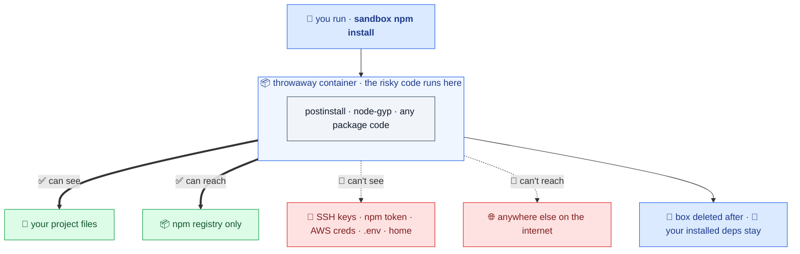

# Put `sandbox` in front of npm, pnpm, yarn, and bun

Safer installs for everyday work and AI agents. Install scripts still work; your laptop secrets stay out.

Your risky `npm install` runs in a throwaway box that can see your project and the npm registry, and nothing else.



Just add `sandbox` in front of the command you already run. Install-time package code (`postinstall`, `node-gyp`) runs in a container with no access to your SSH keys, npm token, cloud credentials, or editor/agent state unless you explicitly grant it. It auto-detects your package manager (npm, pnpm, yarn, or bun) and mirrors it.

## Quickstart

> **First time?** Run it with no install via `npx @jagreehal/sandbox-node@latest <cmd>`, or add it with `npm i -D @jagreehal/sandbox-node`. You need Docker running. See [Install](#install).

```bash
sandbox setup --vibe         # one-button setup: config, backend check, build images
sandbox npm install          # install deps; lifecycle scripts are contained
sandbox pnpm add zod         # add a dependency (saved exact by default)
sandbox pnpm remove zod      # drop one; uninstall scripts run in the box, not your home
sandbox dev                  # run dev/start/serve with native PM syntax
sandbox test                 # run any non-colliding package.json script
sandbox x vite               # one-off tools, npx/bunx-style
```

Tired of typing the prefix? `sandbox path install` wires shell wrappers so a bare `npm install` / `pnpm add` / `npm uninstall` / `npx` routes through the sandbox automatically (undo: `sandbox path uninstall`).

## Works with

Every package manager and the verbs you already use. Put `sandbox` in front of any of them:

| | install | add / remove | update / dedupe | audit | run / exec |
| --- | --- | --- | --- | --- | --- |
| **npm** | `install` · `ci` | `install <pkg>` · `uninstall` | `update` · `dedupe` | `audit` · `audit fix` · `audit signatures` | `run` · `npx` · `x` |
| **pnpm** | `install` | `add` · `remove` | `update` · `dedupe` | `audit` · `audit --fix` · `audit signatures` | `<script>` · `dlx` · `exec` |
| **yarn** | `install` · bare `yarn` | `add` · `remove` | `up` · `upgrade` · `dedupe` | `audit` | `<script>` · `dlx` |
| **bun** | `install` | `add` · `remove` | `update` | `audit` | `<script>` · `bunx` · `x` |

Anything that pulls *new* versions (`install`, `add`, `update`, `dedupe`, `upgrade`) passes through the same supply-chain gates (release-age cooldown, OSV malware check, and risk hints) before the bytes are fetched. Removing a dependency fetches nothing new, so it skips the gates but stays contained.

## Protected by default

- **Credentials.** No `~/.ssh`, `~/.npmrc`, `~/.aws`, or home dir reach the container.
- **Persistence.** `.git`, `.github`, `.husky`, `.claude`, `.vscode`, …, and `package.json` are read-only, so an install can't plant auto-running hooks.
- **Egress.** Default-deny; install reaches only the registry hosts in `egress.allow`.
- **Capabilities.** `--cap-drop ALL`, `--security-opt no-new-privileges`, container-root ≠ host-root.

## NOT protected by default

> ⚠️ **Your source tree stays writable.** Package managers need a writable root, so a malicious dependency can still overwrite files in `src/` during install (you'll see it in `git diff`). `sandbox` blocks credential theft, persistence, and exfiltration. It leaves source edits to you. Use `--frozen` for a read-only tree (npm, yarn, bun; pnpm keeps a writable root), and review `git diff` after installing from an untrusted source.

| What | How to lock it down |
| --- | --- |
| Your **source files** | `--frozen` makes the whole tree read-only (every PM except pnpm) |
| Anything you **grant** (ssh-agent, paths, env, network) | grant the minimum; prefer ssh-agent over key files |
| **Network in `run`/`shell`** | `run.network` defaults to `none`; widen it with `--dev` |

## Common commands

| Command | What it does |
| --- | --- |
| `sandbox setup [--preset N]` | One-button onboarding: write config, check the backend, build images, print next steps. |
| `sandbox npm install` · `pnpm add zod` · `npm uninstall x` | Contained install / add / remove (auto-detects the PM). |
| `sandbox dev` · `sandbox test` · `sandbox x <tool>` | Run a dev server, a script, or a one-off tool in the box. |
| `sandbox path install` | Route bare `npm/pnpm/yarn/bun` + `npx` through the sandbox in your shell. |
| `sandbox doctor [--fix]` | Check config, package manager, backend, daemon, and image state. |
| `sandbox check [pkg \| file.json]` | Audit deps **before** you install them: OSV advisories, typosquats, fresh/deprecated versions. No container, no Docker. Bare `check` audits the whole project (root + every workspace); pass a `package.json` to audit a specific manifest. |
| `sandbox scan` | Retroactive malware sweep over your committed lockfile (CI/cron). |
| `sandbox secrets [path]` | Offline scan for committed credentials (CI tripwire). |
| `sandbox verify` | CI gate: fail unless the repo commits a real, un-loosened sandbox boundary. |

Run `sandbox help` for the full surface, or see the [full reference](docs/reference.md).

## Turn it off

For a repo you trust, opt out of containment so `sandbox` becomes a transparent passthrough:

```bash
sandbox off        # writes off:true to sandbox.config.local.json (your git-ignored override)
sandbox on         # back in the sandbox
SANDBOX_OFF=1 sandbox npm install   # one command (or, exported, a whole shell)
```

`off: true` in `sandbox.config.json` does it for the whole team; `sandbox.config.local.json` (or `sandbox off`) does it just for you, so a globally-wired `sandbox path install` stops sandboxing there. Sandbox-only commands (`check`, `doctor`, `verify`, …) keep working either way.

## Install

```bash
# as a dev dependency (recommended):
npm install -D @jagreehal/sandbox-node

# or from this repo:
npm install && npm run build && npm link
```

The first run builds the sandbox image and the egress-proxy image (or run `sandbox build` first).

### Requirements

- **Docker.** Docker Desktop, OrbStack, or any Docker-compatible engine (Podman works via `--backend podman`). It's the only dependency; the CLI builds its own images on first run.
- **macOS or Linux.** On Windows, run inside WSL2 with Docker Desktop (the tool uses a POSIX shell and Unix paths).
- **Node 20 or newer.**

## Learn more

The reasoning before the command reference, in three short posts:

- [npm install runs code you never read](https://arrangeactassert.com/posts/npm-install-runs-code-you-never-read/)
- [How sandbox runs risky installs in a throwaway container](https://arrangeactassert.com/posts/how-sandbox-runs-risky-installs-in-a-throwaway-container/)
- [How to put sandbox in front of npm, pnpm, yarn, and bun](https://arrangeactassert.com/posts/how-to-put-sandbox-in-front-of-npm-pnpm-yarn-and-bun/)

The **[full reference](docs/reference.md)** covers everything else: isolating the agent itself (hooks, devcontainers), install risk hints, the release-age gate, known-malware checks, canary honeytokens, signed receipts & audit logs, CI recipes, the library API (`runCode`), presets, the config manifest, the security gradient, and network control.

## License

Apache-2.0. See [LICENSE](LICENSE) and [SECURITY.md](SECURITY.md).
