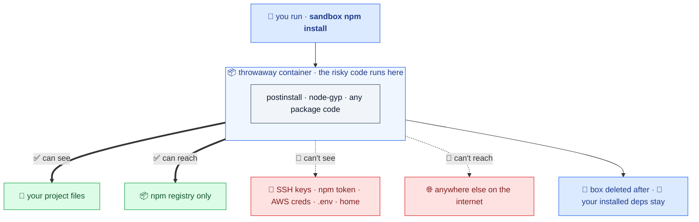

## The threat: `npm install` runs code you never read

A dependency's `postinstall`, `preinstall`, or `node-gyp` step runs arbitrary code on your machine, with your shell's full access: your SSH keys, your npm token, your cloud credentials, your `.env`, your home directory, and the open internet. You didn't read that code, and you can't, for every transitive dependency. That's the supply-chain attack surface sandbox closes.

## The boundary

When you run `sandbox npm install`, the install runs inside a throwaway container:



The container can see your project and reach the registry. It cannot see your credentials or reach the rest of the internet. When the command finishes, sandbox deletes the box; your `node_modules` stays.

## What enforces it

Four controls, on by default:

- **No credentials.** Your home directory and credential files are never mounted. The container starts with nothing of yours except the project.
- **Default-deny egress.** The container reaches only the registry hosts on your allowlist. A proxy blocks everything else and tells you what it stopped.
- **Read-only persistence.** `.git`, `.github`, `.husky`, `.claude`, `.vscode`, and `package.json` are mounted read-only, so an install can't plant a hook that runs later.
- **Dropped capabilities.** `--cap-drop ALL`, `--security-opt no-new-privileges`, and a container-root that is not your host root.

## Supply-chain gates, before the bytes arrive

Anything that pulls a *new* version (`install`, `add`, `update`, `dedupe`, `upgrade`) passes the gates first:

- **Release-age cooldown.** Blocks versions published in the last N days when you set one, the window where publish-and-detonate worms live.
- **OSV malware check.** Blocks versions flagged as known malware.
- **Risk hints.** Surfaces typosquats, provenance regressions, maintainer changes, and freshly-published versions.

Removing a dependency fetches nothing new, so it skips the gates but still runs contained.

## It mirrors your package manager

You don't learn a new vocabulary. sandbox auto-detects npm, pnpm, yarn, or bun from your lockfile and `packageManager` field, and runs the command you typed inside the box. `sandbox pnpm add zod` stays pnpm; `sandbox npm ci` stays a frozen install.

:::note[The container runs Linux]
Installs resolve native optional dependencies for Linux. Run your project's tools through sandbox too (`sandbox test`, `sandbox dev`) so they match, or reinstall on the host when you need host-native binaries. `sandbox doctor` flags a mismatch before a test run hits it.
:::

## Turn it off for a repo you trust

`sandbox` is a transparent passthrough when containment is off:

```bash
sandbox off        # writes off:true to a git-ignored local override
sandbox on         # back in the box
SANDBOX_OFF=1 sandbox npm install   # one command
```

Sandbox-only commands (`check`, `doctor`, `verify`, …) keep working either way.
